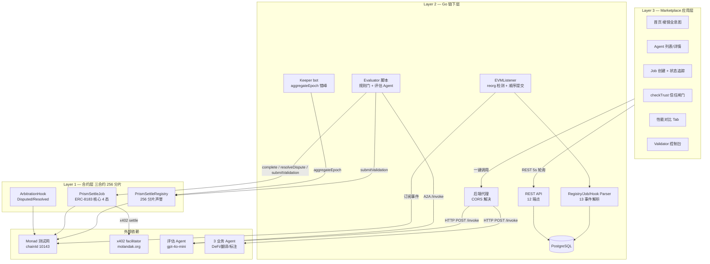
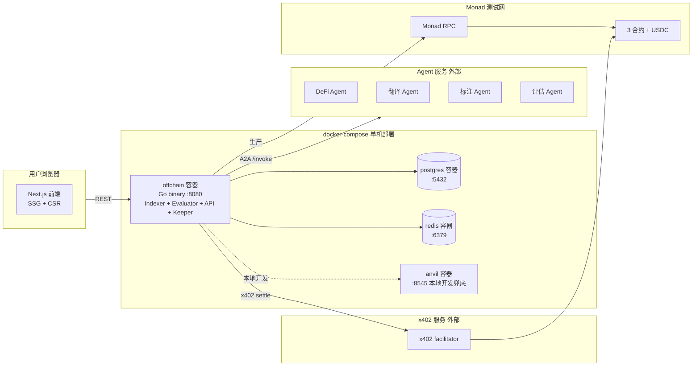
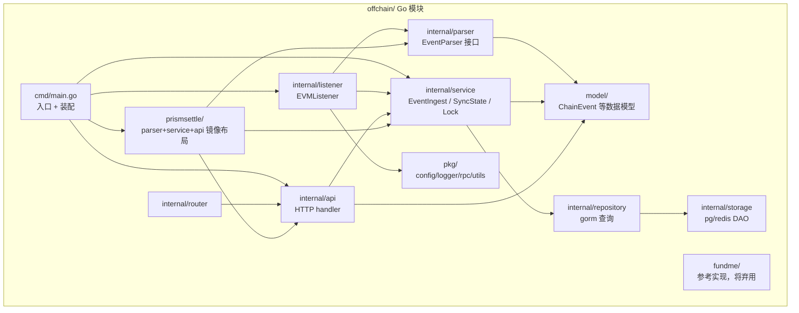
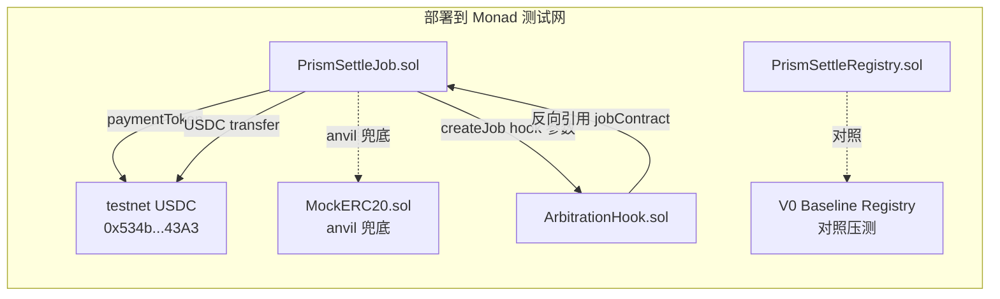
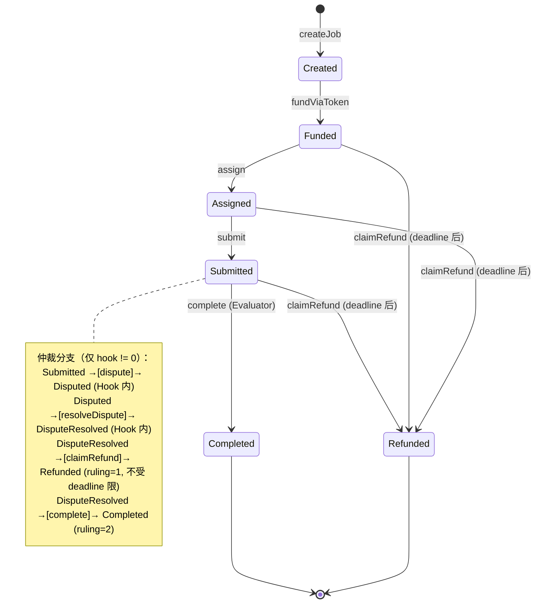
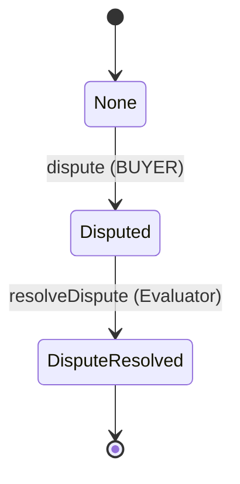
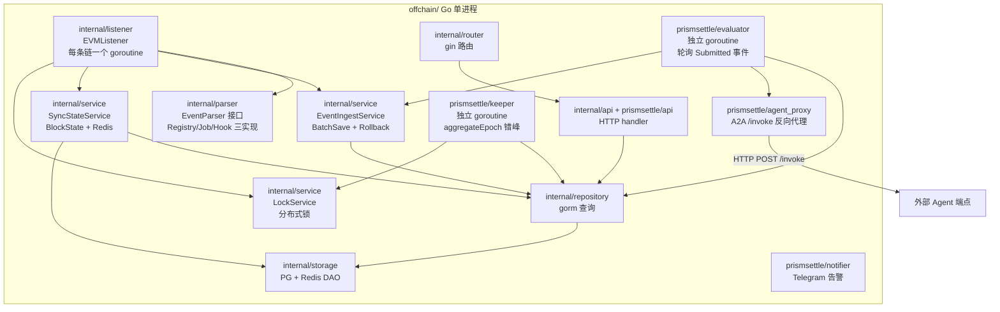
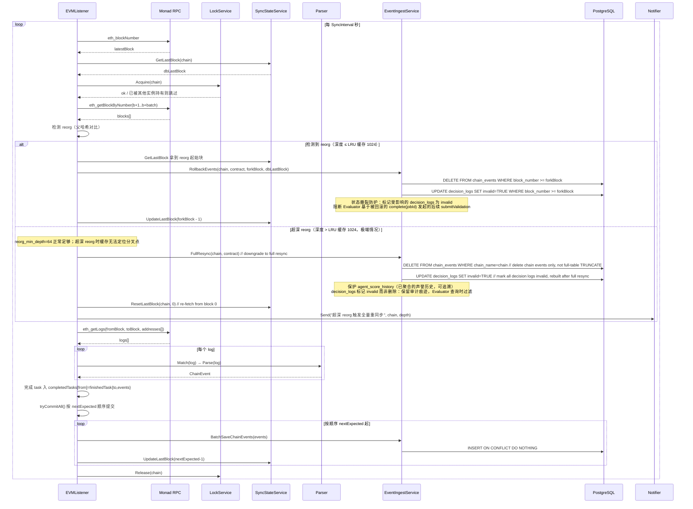
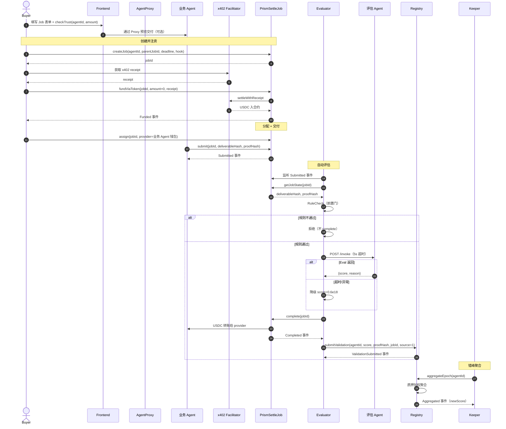

# PrismSettle — 软件设计方案 (SD 1.0)

| 文档信息 | |
|---|---|
| 产品名称 | PrismSettle |
| 文档版本 | 1.0 |
| 状态 | Draft |
| 基础文档 | [PRD.zh-CN.v1.0.md](./PRD.zh-CN.v1.0.md) |
| 作者 | PrismSettle 团队 |

---

## 目录

1. [概述](#1-概述)
2. [系统架构总览](#2-系统架构总览)
3. [合约层详细设计](#3-合约层详细设计)
4. [链下层详细设计](#4-链下层详细设计)
5. [前端层详细设计](#5-前端层详细设计)
6. [部署与运维](#6-部署与运维)
7. [关键流程时序图](#7-关键流程时序图)
8. [附录](#8-附录)

---

## 1. 概述

### 1.1 文档目的与范围

本文档基于 [PRD.zh-CN.v1.0](./PRD.zh-CN.v1.0.md) 编写，目标是把产品需求落地为可直接编码的软件设计方案。覆盖范围：

- **合约层**：`PrismSettleRegistry` / `PrismSettleJob` / `ArbitrationHook` 三合约的存储布局、接口签名、状态机、权限模型、伪代码
- **链下层**：Indexer / Parser / Evaluator / Keeper bot / API 服务、数据库设计
- **前端层**：Marketplace 页面、组件、状态管理、与后端交互
- **部署与运维**：docker-compose、测试网部署、Seed Phase、对照压测方案
- **关键流程时序图**：用 Mermaid 描述 6 个核心流程

详细到接口签名 + 关键伪代码 + 模块依赖图，开发者可据此直接编码。

### 1.2 设计原则

| 原则 | 说明 |
|---|---|
| **OCC 优先** | 合约存储布局以"消除 Monad OCC 写冲突"为第一性目标，所有热点写路径必须分片或延迟聚合 |
| **核心 4 态纯净** | ERC-8183 核心 4 态（Open/Funded/Submitted/Terminal）严格对齐官方，仲裁逻辑全部封装到独立 ArbitrationHook |
| **fail-fast** | 配置缺失、依赖不可达等关键错误立即退出，不静默降级 |
| **exactly-once 入库** | Indexer 通过 `nextExpected`/`completedTasks` 计数器保证事件不重复不丢失 |
| **EIP-55 原值存储** | 链上地址以原始大小写形式入库，查询时 `LOWER()` 归一化 |
| **英文代码 / 中文文档** | 代码、注释、日志、commit message 全英文；本文档及对外说明用中文 |
| **不做向后兼容 shim** | 直接改，不引入兼容层（NFR-M04） |

### 1.3 与 PRD 的映射

PRD 的所有 P0/P1 功能需求（FR-*）和非功能需求（NFR-*）均在本文档对应章节落地。完整映射表见 [§8.1](#81-fr--设计章节映射表)。

---

## 2. 系统架构总览

### 2.1 三层架构



### 2.2 部署拓扑



### 2.3 技术栈

| 层 | 技术栈 | 版本 |
|---|---|---|
| 智能合约 | Solidity + Foundry | 0.8.24+ / Cancun EVM |
| 链下服务 | Go + go-ethereum + zap + gorm + gin | Go 1.22+ |
| 数据库 | PostgreSQL | 14+ |
| 缓存 | Redis | 7+ |
| 前端 | Next.js + React + Tailwind + shadcn/ui + Framer Motion + GSAP | Next.js 15 / React 19 / Tailwind v4 |
| 部署 | docker-compose + anvil | — |
| 测试 | Foundry forge + Go testing | — |

### 2.4 模块依赖关系



### 2.5 关键设计决策摘要

| 决策 | 选择 | 理由 |
|---|---|---|
| 分片数 | 256 | 8 bits，500 并发下生日界限 P(冲突)~30% + 延迟聚合 → 压测验证 |
| 分片键 | `agentId & 0xFF` / `jobId & 0xFF` | 低 8 位，分布均匀 |
| 聚合限速 | EPOCH = 1 minute | 解耦"高频写"和"低频聚合读" |
| 聚合触发方 | Keeper bot 错峰调用 | 避免同时间所有 Agent 都聚合 |
| Reorg 检测 | 父哈希对比 | 行业标准，简单正确 |
| 顺序提交 | `nextExpected`/`completedTasks` 计数器 | exactly-once 入库 |
| ERC-8183 状态机 | 核心 4 态 + ArbitrationHook 独立合约 | 遵循官方 Hook 扩展哲学 |
| 资金入口 | `fundViaToken(jobId, amount, x402Receipt)` 统一入口 | x402 / ERC-20 共用 Funded 事件；amount 在 x402 路径传 0（由 receipt 决定），ERC-20 路径显式传入 |
| 评估能力 | 评估 Agent（A2A `/invoke`） | 评估能力市场化，可替换 |
| 前端数据刷新 | 5s 轮询 + 服务端 block_number 增量 | 工程权衡，不做 websocket |
| CORS 解决 | 后端代理 Agent 端点 | 前端不直接跨域 |
| 地址存储 | 原始 EIP-55 + 查询 LOWER() | 保留校验和信息 |

---

## 3. 合约层详细设计

### 3.1 合约清单与部署关系



| 合约 | 文件路径 | 职责 |
|---|---|---|
| `PrismSettleRegistry` | `contracts/src/PrismSettleRegistry.sol` | Agent 注册 + 256 分片声誉 + 质押 + 聚合 |
| `PrismSettleJob` | `contracts/src/PrismSettleJob.sol`（新增） | ERC-8183 核心 4 态 + 256 分片 + x402/ERC-20 资金托管 |
| `ArbitrationHook` | `contracts/src/ArbitrationHook.sol`（新增） | 仲裁态封装（Disputed/DisputeResolved） |
| `MockERC20` | `contracts/src/mocks/MockERC20.sol`（新增） | anvil 本地兜底 token |
| `BaselineRegistry` | `contracts/src/bench/BaselineRegistry.sol`（新增） | V0 单槽存储基线，用于对照压测（FR-T01） |

### 3.2 PrismSettleRegistry

#### 3.2.1 存储布局（256 分片原理）

```mermaid
graph LR
    subgraph Hot[高频写路径 submitValidation]
        Submit[submitValidation<br/>agentId, score, proofHash]
        Shard[shardValidations<br/>shardOf(agentId)<br/>agentId]
        Submit --> Shard
    end

    subgraph Cold[低频写路径 aggregateEpoch]
        Agg[aggregateEpoch<br/>agentId]
        Score[aggregatedScore<br/>agentId]
        Agg --> Score
    end

    subgraph Meta[元数据 几乎只读]
        Agents[agents<br/>agentId]
        Stake[validatorStake<br/>validator]
    end

    Shard -.读.-> Agg
```

**OCC 友好性论证**：
- `submitValidation` 只写 `shardValidations[shardOf(agentId)][agentId]`，两个不同 agent 的写入几乎必然落到不同 storage slot（冲突概率 = 1/256，500 并发下生日界限 P(冲突)~30%，配合延迟聚合后实测 < 5%）
- `aggregateEpoch` 只写 `aggregatedScore[agentId]`，由 Keeper bot 错峰调用，避免热点
- `agents` / `validatorStake` 在热路径上只读

#### 3.2.2 数据结构

```solidity
// SPDX-License-Identifier: MIT
pragma solidity 0.8.24;

contract PrismSettleRegistry {
    // ----- Constants -----
    uint256 public constant SHARD_COUNT = 256;        // 8 bits
    uint256 public constant MIN_STAKE = 100 ether;    // 100 MON, anti-Sybil
    uint256 public constant EPOCH = 1 minutes;        // aggregation rate-limit window
    uint256 public constant UNSTAKE_LOCK = 7 days;    // unstake lock-up period
    uint256 public constant MAX_RECORDS = 100;        // max records per aggregateEpoch call, prevents gas explosion
    uint256 public constant MAX_VALIDATIONS_PER_EPOCH = 50;  // per-agent per-epoch Validator validation cap, anti-sybil

    // ----- Roles -----
    bytes32 public constant REGISTRY_EVALUATOR_ROLE = keccak256("REGISTRY_EVALUATOR_ROLE");
    // Evaluator holds this role to call submitValidation without stake, source in {1,2}

    // ----- Types -----
    struct ValidationRecord {
        address validator;     // Validator address or Evaluator address (source != 0)
        uint96  score;         // 0..1e18 fixed-point (1e18 = 1.0)
        bytes32 proofHash;     // deliverable proof_hash
        uint64  timestamp;
        uint8   source;        // 0=Validator / 1=Evaluator-Job / 2=Evaluator-Arbitration
        uint256 jobId;         // 0 when source=0; Job id when source in {1,2}
    }

    struct AgentMetadata {
        bool    registered;
        address owner;
        string  endpointUrl;   // Agent invocation endpoint, e.g. https://agent.example.com (FR-AP04)
        string  capabilities;  // JSON string, capability tags
        uint64  lastAggregate;
        uint96  seedScore;     // Seed Phase preset initial score 0.7e18
        uint64  registeredAt;
        uint64  taskCount;     // aggregated task count (used for EMA smoothing alpha=1/(1+taskCount))
        uint64  lastActivity;  // last submitValidation timestamp (used for inactivity decay)
    }

    struct StakeInfo {
        uint256 amount;
        uint64  unstakeAt;     // 0 = no pending unstake; >0 = in 7-day unlock period
    }

    // ----- Storage -----
    mapping(uint8 => mapping(uint256 => ValidationRecord[])) public shardValidations;
    mapping(uint256 => uint256) public aggregatedScore;       // final aggregated score
    mapping(uint256 => AgentMetadata) public agents;
    mapping(address => StakeInfo) public validatorStake;

    address public owner;  // deployer, only used for one-shot Seed Phase calls
}
```

> **V1 升级点（相对现有 Registry.sol）**：① `ValidationRecord` 增 `source` / `jobId` 字段；② 新增 `REGISTRY_EVALUATOR_ROLE`；③ 新增 `unstake` 7 天解锁期（FR-C10）；④ 新增 `AgentMetadata.seedScore`（FR-C09）+ `endpointUrl` / `capabilities` 字段（FR-AP04，对齐 PRD §734）；⑤ `registerAgent` 增 `metadata` 参数；⑥ `aggregateEpoch` 改用 EMA 平滑 + 不活跃衰减（§3.2.5）；⑦ 仲裁惩罚分公式化（§3.4.3，替换硬编码 0.1e18）。

#### 3.2.3 接口签名

```solidity
// ----- Agent registration -----
function registerAgent(uint256 agentId, string calldata metadata) external;
// FR-C01: register Agent, metadata includes endpoint URL; caller is owner

// ----- Validator staking -----
function stake() external payable;                                  // FR-C02
function unstake(uint256 amount) external;                          // FR-C10, enters 7-day unlock period
function withdrawUnstaked() external;                               // withdraw after unlock period
function slash(address validator, bytes32 evidenceHash) external;   // FR-C05 (V1: Owner only)

// ----- Reputation write (dual-channel) -----
function submitValidation(
    uint256 agentId,
    uint96  score,
    bytes32 proofHash,
    uint256 jobId,
    uint8   source
) external;  // FR-C03
// - Validator call: require source==0 && jobId==0 && validatorStake >= MIN_STAKE
// - Evaluator call: require source in {1,2} && hasRole(REGISTRY_EVALUATOR_ROLE)
// - Validation: score <= 1e18 && agents[agentId].registered

function aggregateEpoch(uint256 agentId) external;  // FR-C04, EPOCH rate-limited

// ----- Views -----
// getScore dynamically computes inactivity decay at read time: no storage write, zero gas, real-time score
// Implementation: stored = aggregatedScore[agentId]; (decayed,) = applyDecay(stored, agents[agentId].lastActivity, block.timestamp); return decayed;
function getScore(uint256 agentId) external view returns (uint256);            // FR-C06
function getValidationCount(uint256 agentId) external view returns (uint256);  // FR-C07
function getValidation(uint256 agentId, uint256 index)
    external view returns (address validator, uint96 score, bytes32 proofHash,
                           uint64 timestamp, uint8 source, uint256 jobId);     // FR-C12
function shardOf(uint256 agentId) public pure returns (uint8);                 // { return uint8(agentId & 0xFF); }

// ----- Rewards（V1 stub） -----
function claimRewards() external pure;  // FR-C11，revert("V2 only")
```

#### 3.2.4 权限矩阵

| 函数 | 任意地址 | Validator（已质押） | Evaluator | Agent Owner | 部署 Owner |
|---|---|---|---|---|---|
| `registerAgent` | ✓ | | | | |
| `stake` | ✓ | | | | |
| `unstake` / `withdrawUnstaked` | | ✓（仅自己） | | | |
| `submitValidation` source=0 | | ✓ | | | |
| `submitValidation` source∈{1,2} | | | ✓（持 `REGISTRY_EVALUATOR_ROLE`） | | |
| `aggregateEpoch` | ✓（不限） | | | | |
| `slash` | | | | | ✓（V1） |
| `claimRewards` | — | | | | — (revert) |

#### 3.2.5 关键函数伪代码

```solidity
function submitValidation(uint256 agentId, uint96 score, bytes32 proofHash,
                          uint256 jobId, uint8 source) external {
    AgentMetadata storage info = agents[agentId];
    require(info.registered, "not registered");
    require(score <= 1e18, "score>1e18");

    if (source == 0) {
        // Validator channel
        require(validatorStake[msg.sender].amount >= MIN_STAKE, "insufficient stake");
        require(jobId == 0, "validator jobId must be 0");
    } else if (source == 1 || source == 2) {
        // Evaluator channel
        require(hasRole(REGISTRY_EVALUATOR_ROLE, msg.sender), "not evaluator");
    } else {
        revert("invalid source");
    }

    uint8 shard = shardOf(agentId);
    ValidationRecord[] storage records = shardValidations[shard][agentId];

    // Anti-sybil: Validator (source=0) can accumulate at most MAX_VALIDATIONS_PER_EPOCH records per epoch (between two aggregateEpoch calls)
    // Semantics: records array is cleared in aggregateEpoch, so records.length is the Validator count accumulated in this epoch
    // Attack cost: 50 records * 100 MON stake = 5000 MON to fill an epoch, plus EMA smoothing keeps impact bounded
    // Evaluator (source!=0) exempt: single trusted instance, no sybil risk, not counted against quota
    if (source == 0) {
        require(records.length < MAX_VALIDATIONS_PER_EPOCH, "epoch quota exceeded");
    }

    records.push(ValidationRecord({
        validator:  msg.sender,
        score:      score,
        proofHash:  proofHash,
        timestamp:  uint64(block.timestamp),
        source:     source,
        jobId:      jobId
    }));
    // Update lastActivity, reset inactivity decay timer
    agents[agentId].lastActivity = uint64(block.timestamp);

    emit ValidationSubmitted(agentId, shard, msg.sender, score, proofHash,
                             uint64(block.timestamp), source, jobId);
}

function aggregateEpoch(uint256 agentId) external {
    AgentMetadata storage info = agents[agentId];
    require(info.registered, "not registered");
    require(block.timestamp >= uint256(info.lastAggregate) + EPOCH, "epoch not due");

    uint8 shard = shardOf(agentId);
    ValidationRecord[] storage records = shardValidations[shard][agentId];
    uint256 oldScore = aggregatedScore[agentId];

    if (records.length == 0) {
        // No new validation: still check inactivity decay
        info.lastAggregate = uint64(block.timestamp);
        (uint256 decayedScore, uint256 decay) = applyDecay(oldScore, info.lastActivity, block.timestamp);
        if (decayedScore != oldScore) {
            aggregatedScore[agentId] = decayedScore;
        }
        emit Aggregated(agentId, oldScore, decayedScore, 0, info.taskCount, decay);
        return;
    }

    // 1. Stake-weighted average: Validator weighted by stake; Evaluator weight = 1
    // Gas protection + FIFO: process at most MAX_RECORDS oldest records per call, newer ones deferred to next epoch
    // Deletion: tail element overwrites head then pop, O(1) per record; remaining order is shuffled,
    //           but weighted average is order-independent, correctness preserved
    uint256 processCount = records.length > MAX_RECORDS ? MAX_RECORDS : records.length;
    uint256 weightedSum = 0;
    uint256 totalWeight = 0;
    for (uint256 i = 0; i < processCount; i++) {
        ValidationRecord storage r = records[0];  // always take head (oldest unprocessed)
        uint256 w = (r.source == 0)
            ? validatorStake[r.validator].amount
            : 1;
        if (w == 0) w = 1;  // fallback: slashed Validator's historical records still participate
        weightedSum += uint256(r.score) * w;
        totalWeight += w;
        // O(1) head removal: tail overwrites head then pop (order shuffled but weighted average unaffected)
        records[0] = records[records.length - 1];
        records.pop();
    }
    uint256 weighted = totalWeight == 0 ? info.seedScore : weightedSum / totalWeight;

    // 2. EMA smoothing: newScore = oldScore + alpha * (weighted - oldScore)
    //    alpha = 1e18 / (1e18 + taskCount); larger taskCount => smaller change, avoids extreme single-rating swings
    uint256 alpha = 1e18 / (1e18 + uint256(info.taskCount));
    uint256 newScore;
    if (weighted >= oldScore) {
        newScore = oldScore + alpha * (weighted - oldScore) / 1e18;
    } else {
        newScore = oldScore - alpha * (oldScore - weighted) / 1e18;
    }

    // 3. Inactivity decay: after 30 days of inactivity, deduct 0.01e18 per day (anti "one-time high score forever")
    uint256 decayApplied = 0;
    (newScore, decayApplied) = applyDecay(newScore, info.lastActivity, block.timestamp);

    // 4. Boundary protection
    if (newScore > 1e18) newScore = 1e18;  // upper bound 1.0

    aggregatedScore[agentId] = newScore;
    info.lastAggregate = uint64(block.timestamp);
    info.taskCount += uint64(processCount);
    // NOTE: lastActivity is updated only in submitValidation (real business scoring), never here
    // Reason: aggregateEpoch is triggered periodically by Keeper, does not indicate Agent business activity
    // If updated here, as long as Keeper runs, Agent would never decay, anti "one-time high score forever" mechanism fails
    // 5. Processed records have been popped in the loop above
    // If records still have remaining (>MAX_RECORDS case), keep them for next epoch
    // Normal case (<=MAX_RECORDS): records.length == 0 here, equivalent to cleared

    emit Aggregated(agentId, oldScore, newScore, processCount, info.taskCount, decayApplied);
}

// Inactivity decay uses a dual-path design:
//   - Read-time computation (getScore view): dynamically calls applyDecay to return decayed real-time score, no storage write, zero gas
//   - Lazy persistence (aggregateEpoch): writes decay into storage when called, single-call gas overhead ~2k
//   - Keeper bot scan: periodically calls aggregateEpoch on long-inactive agents to trigger persistence (see §4.6.3)
// Guarantees: 1) Gas is always O(1) per agent, does not grow with total agent count; 2) Read consistency ensured by view; 3) Persistence triggered asynchronously by Keeper
// Inactivity decay: deduct DECAY_PER_DAY per day after INACTIVE_DAYS
// Pure function, does not write storage; caller is responsible for persistence
function applyDecay(uint256 score, uint256 lastActivity, uint256 nowTs)
    internal pure returns (uint256 newScore, uint256 decay) {
    if (lastActivity == 0 || nowTs <= lastActivity) {
        return (score, 0);
    }
    uint256 idleDays = (nowTs - lastActivity) / 1 days;
    if (idleDays <= INACTIVE_DAYS) {
        return (score, 0);
    }
    uint256 decayDays = idleDays - INACTIVE_DAYS;
    decay = decayDays * DECAY_PER_DAY;  // 0.01e18 / day
    newScore = score > decay ? score - decay : 0;
}
// Constants: uint256 constant INACTIVE_DAYS = 30; uint256 constant DECAY_PER_DAY = 0.01e18;

// unstake semantics (V1 simplified):
//   - require(s.unstakeAt == 0) ensures only one in-flight unstake at a time, no unlock-period overwrite
//   - Partial unstake supported (amount may be less than s.amount), but after initiating must wait 7-day unlock and call withdrawUnstaked before another unstake
//   - For multiple partial unstakes, must first withdrawUnstaked to reset unstakeAt to 0 before initiating a new unstake
function unstake(uint256 amount) external {
    StakeInfo storage s = validatorStake[msg.sender];
    require(s.amount >= amount, "insufficient stake");
    require(s.unstakeAt == 0, "already unstaking");
    s.amount -= amount;
    s.unstakeAt = uint64(block.timestamp);
    emit UnstakeStarted(msg.sender, amount, s.unstakeAt + UNSTAKE_LOCK);
}

function withdrawUnstaked() external {
    StakeInfo storage s = validatorStake[msg.sender];
    require(s.unstakeAt > 0, "no pending unstake");
    require(block.timestamp >= uint256(s.unstakeAt) + UNSTAKE_LOCK, "lock not expired");
    uint256 payout = s.amount;  // note: V1 simplified, only locks the unstake amount
    s.amount = 0;
    s.unstakeAt = 0;
    (bool ok, ) = payable(msg.sender).call{value: payout}("");
    require(ok, "transfer failed");
    emit UnstakeWithdrawn(msg.sender, payout);
}
```

#### 3.2.6 事件清单

```solidity
event AgentRegistered(uint256 indexed agentId, address indexed owner, string metadata);
event ValidationSubmitted(
    uint256 indexed agentId, uint8 indexed shard, address indexed validator,
    uint96 score, bytes32 proofHash, uint64 timestamp, uint8 source, uint256 jobId
);
event Aggregated(
    uint256 indexed agentId, uint256 oldScore, uint256 newScore,
    uint256 count, uint64 taskCount, uint256 decay
);
event Staked(address indexed validator, uint256 amount);
event Slashed(address indexed validator, uint256 amount, bytes32 evidenceHash);
event UnstakeStarted(address indexed validator, uint256 amount, uint64 unlockAt);
event UnstakeWithdrawn(address indexed validator, uint256 amount);
```

#### 3.2.7 声誉计算分层说明（链上 vs 链下）

| 计算项 | 实现位置 | 理由 |
|--------|---------|------|
| 质押加权平均 | 链上 `aggregateEpoch` | 去中心化、anyone 可调、逻辑透明 |
| EMA 平滑 | 链上 `aggregateEpoch` | Gas 增量约 5k（1 SSTORE + 除法），保持聚合去中心化 |
| Slash 公式化 | 链下 Evaluator（FR-E13） | 拉取 `aggregatedScore` 后算出惩罚分，通过 `submitValidation(source=2)` 提交；合约不感知公式 |
| 不活跃衰减（计算） | 链上 `getScore` view + `aggregateEpoch` | 读时计算零 Gas（view）；聚合时持久化 Gas 增量约 2k；O(1) 单 agent 不随总数增长 |
| 不活跃衰减（持久化触发） | 链下 Keeper `InactiveScanner`（§4.6.3） | 长期不活跃 agent 无人调 `aggregateEpoch`，Keeper 定期扫描触发持久化，保证 storage 与 view 一致 |
| 金额 / 速度多维加权 | 链下 Evaluator（V1 未启用，预留） | 跨合约读 Job 的 `deadline` / `amount` Gas 高；维度调整需灵活，链下计算后作为 `score` 提交，合约不感知维度 |

> **设计原则**：合约层只保留「去中心化必需 + Gas 可接受」的核心计算（加权 + EMA + 衰减）；公式化惩罚和多维加权交给链下，通过 `submitValidation` 的 `score` 字段注入，合约层仅做加权聚合，不绑定具体公式。这样既能保持 `aggregateEpoch` 的 anyone 可调特性，又能让评分维度随业务演进无需重新部署合约。

### 3.3 PrismSettleJob

#### 3.3.1 数据结构

```solidity
contract PrismSettleJob {
    // ----- Constants -----
    bytes32 public constant COMMERCE_EVALUATOR_ROLE = keccak256("COMMERCE_EVALUATOR_ROLE");

    // ----- Types -----
    // ERC-8183 official 4 states = Open / Funded / Submitted / Terminal
    // Mapping: Open=Created, Funded=Funded, Submitted=Assigned->Submitted,
    //          Terminal=Completed/Refunded (dual branch); arbitration states not in this enum
    enum JobState { Created, Funded, Assigned, Submitted, Completed, Refunded }

    struct Job {
        address buyer;
        address provider;
        uint256 amount;          // locked USDC amount
        bytes32 deliverableHash; // IPFS hash or content hash
        bytes32 proofHash;       // execution proof hash (formal compliance check)
        uint64  deadline;        // timeout refund deadline
        JobState state;
        uint256 parentJobId;     // secondary dispatch hook (V1: interface only)
        address hook;            // ArbitrationHook address (0 = not mounted)
        uint64  createdAt;
    }

    // ----- Storage -----
    mapping(uint8 => mapping(uint256 => Job)) public shardJobs;  // shardJobs[jobId & 0xFF][jobId]
    mapping(address => uint256) public buyerNonce;  // account-level nonce for jobId generation, avoids global write lock
    mapping(bytes32 => bool) public usedReceipts;   // x402 receipt anti-replay (FR-J02 security constraint)
    IERC20 public paymentToken;  // testnet USDC; anvil fallback MockERC20
}
```

#### 3.3.2 状态机



#### 3.3.3 接口签名

```solidity
function createJob(bytes32 agentId, uint256 parentJobId, uint64 deadline, address hook)
    external returns (uint256 jobId);
function fundViaToken(uint256 jobId, uint256 amount, bytes calldata x402Receipt) external;
function assign(uint256 jobId, address provider) external;
function submit(uint256 jobId, bytes32 deliverableHash, bytes32 proofHash) external;
function complete(uint256 jobId) external;                       // COMMERCE_EVALUATOR_ROLE only
function claimRefund(uint256 jobId) external;
function getJobState(uint256 jobId) external view returns (
    JobState state, address buyer, address provider, uint256 amount,
    bytes32 deliverableHash, bytes32 proofHash, uint64 deadline, address hook
);
```

#### 3.3.4 资金流（x402 / ERC-20 分流）

```mermaid
graph LR
    Buyer[BUYER]
    Fac[x402 Facilitator]
    JobC[Job 合约]
    USDC[USDC Token]

    Buyer -->|1. 获取 x402 receipt| Fac
    Fac -->|2. 校验 receipt| Fac
    Buyer -->|3. fundViaToken jobId receipt| JobC
    JobC -->|4a. 有 receipt| Fac
    Fac -->|5. transferFrom buyer→contract| USDC
    USDC -->|6. USDC 入合约| JobC

    Buyer -.无 receipt.-> JobC
    JobC -.4b. transferFrom buyer→contract.-> USDC
    USDC -.USDC 入合约.-> JobC
```

#### 3.3.5 关键函数伪代码

```solidity
function createJob(bytes32 agentId, uint256 parentJobId, uint64 deadline, address hook)
    external returns (uint256 jobId) {
    require(deadline > block.timestamp, "deadline passed");
    // Account-level nonce generates jobId: write lock downgraded from "global hotspot" to "account-level", eliminates createJob OCC conflicts
    // Different buyers' createJob do not interfere; same buyer's consecutive createJob writes via nonce ordering
    uint256 nonce = buyerNonce[msg.sender]++;
    jobId = uint256(keccak256(abi.encodePacked(msg.sender, nonce)));
    uint8 shard = uint8(jobId & 0xFF);
    shardJobs[shard][jobId] = Job({
        buyer: msg.sender, provider: address(0), amount: 0,
        deliverableHash: bytes32(0), proofHash: bytes32(0),
        deadline: deadline, state: JobState.Created,
        parentJobId: parentJobId, hook: hook,
        createdAt: uint64(block.timestamp)
    });
    emit JobCreated(agentId, jobId, msg.sender, deadline, hook);
}

function fundViaToken(uint256 jobId, uint256 amount, bytes calldata x402Receipt) external {
    Job storage j = shardJobs[uint8(jobId & 0xFF)][jobId];
    require(j.state == JobState.Created, "bad state");
    require(msg.sender == j.buyer, "not buyer");

    uint256 funded;
    if (x402Receipt.length > 0) {
        // x402 path: settled via Monad official facilitator (FR-AP08)
        // Facilitator verifies receipt and transfers USDC from buyer to contract; amount determined by receipt
        // Trust boundary: FACILITATOR must be Monad official trusted contract; if Facilitator reverts/stalls,
        // fundViaToken reverts, Job stuck in Created (buyer can resubmit or switch to ERC-20 path)
        require(amount == 0, "amount must be 0 when receipt present");

        // Anti-replay: each x402 receipt can only be used once (FR-J02 security constraint)
        // Even if facilitator has its own anti-replay, contract layer adds double protection against receipt copy attacks
        bytes32 receiptHash = keccak256(x402Receipt);
        require(!usedReceipts[receiptHash], "receipt used");
        usedReceipts[receiptHash] = true;

        funded = IX402Facilitator(FACILITATOR).settleWithReceipt(
            j.buyer, address(this), x402Receipt
        );
    } else {
        // ERC-20 fallback path (FR-AP09): buyer must approve in advance, amount passed explicitly
        require(amount > 0, "zero amount");
        require(paymentToken.transferFrom(j.buyer, address(this), amount), "transferFrom failed");
        funded = amount;
    }
    j.amount = funded;
    j.state = JobState.Funded;
    emit Funded(jobId, j.buyer, funded);
}

function complete(uint256 jobId) external {
    require(hasRole(COMMERCE_EVALUATOR_ROLE, msg.sender), "not evaluator");
    Job storage j = shardJobs[uint8(jobId & 0xFF)][jobId];
    require(j.state == JobState.Submitted, "bad state");
    j.state = JobState.Completed;
    require(paymentToken.transfer(j.provider, j.amount), "payout failed");
    emit Completed(jobId, j.provider, j.amount);
}

function claimRefund(uint256 jobId) external {
    Job storage j = shardJobs[uint8(jobId & 0xFF)][jobId];
    require(j.state == JobState.Funded || j.state == JobState.Assigned ||
            j.state == JobState.Submitted, "bad state");
    require(msg.sender == j.buyer, "not buyer");

    // Normal refund requires deadline passed; arbitration ruling=1 allows immediate refund
    if (j.hook != address(0)) {
        (, , uint8 ruling) = ArbitrationHook(j.hook).getHookState(jobId);
        if (ruling != 1) {
            require(block.timestamp >= j.deadline, "deadline not reached");
        }
    } else {
        require(block.timestamp >= j.deadline, "deadline not reached");
    }

    j.state = JobState.Refunded;
    require(paymentToken.transfer(j.buyer, j.amount), "refund failed");
    emit Refunded(jobId, j.buyer, j.amount);
}

function submit(uint256 jobId, bytes32 deliverableHash, bytes32 proofHash) external {
    Job storage j = shardJobs[uint8(jobId & 0xFF)][jobId];
    require(j.state == JobState.Assigned, "bad state");
    require(msg.sender == j.provider, "not provider");
    require(deliverableHash != bytes32(0), "empty deliverable");
    require(proofHash != bytes32(0), "empty proof");

    j.deliverableHash = deliverableHash;
    j.proofHash = proofHash;
    j.state = JobState.Submitted;
    emit Submitted(jobId, deliverableHash, proofHash);

    // If hook mounted, trigger Hook dispute entry (PRD §55 implementation boundary: no full Hook callback mechanism,
    // only triggers Hook dispute entry onSubmitted after submit, for BUYER to subsequently initiate dispute)
    if (j.hook != address(0)) {
        ArbitrationHook(j.hook).onSubmitted(jobId);
    }
}
```

#### 3.3.6 事件清单

```solidity
event JobCreated(bytes32 indexed agentId, uint256 indexed jobId, address buyer, uint64 deadline, address hook);
event Funded(uint256 indexed jobId, address buyer, uint256 amount);
event Assigned(uint256 indexed jobId, address provider);
event Submitted(uint256 indexed jobId, bytes32 deliverableHash, bytes32 proofHash);
event Completed(uint256 indexed jobId, address provider, uint256 amount);
event Refunded(uint256 indexed jobId, address buyer, uint256 amount);
```

### 3.4 ArbitrationHook

#### 3.4.1 数据结构

```solidity
contract ArbitrationHook {
    enum HookState { None, Disputed, DisputeResolved }

    struct HookData {
        bytes32 disputeReason;  // BUYER arbitration reason hash
        uint8   disputeRuling;  // 0=not ruled 1=BUYER 2=Provider
        HookState state;
    }

    mapping(uint256 => HookData) public hookData;  // jobId → HookData
    address public jobContract;                    // back-reference, for permission check
    bytes32 public constant RESOLVER_ROLE = keccak256("RESOLVER_ROLE");
}
```

#### 3.4.2 状态机



#### 3.4.3 接口签名与伪代码

```solidity
function onSubmitted(uint256 jobId) external;  // only Job contract can call, records entry
function dispute(uint256 jobId, bytes32 reasonHash) external;
function resolveDispute(uint256 jobId, uint8 ruling) external;  // RESOLVER_ROLE only
function getHookState(uint256 jobId) external view returns (HookState state, bytes32 reasonHash, uint8 ruling);

function dispute(uint256 jobId, bytes32 reasonHash) external {
    HookData storage h = hookData[jobId];
    require(h.state == HookState.None, "already disputed");
    // Verify msg.sender is the Job's buyer: query Job contract
    (, address buyer, , , , , , ) = PrismSettleJob(jobContract).getJobState(jobId);
    require(msg.sender == buyer, "not buyer");
    h.disputeReason = reasonHash;
    h.state = HookState.Disputed;
    emit Disputed(jobId, reasonHash);
}

function resolveDispute(uint256 jobId, uint8 ruling) external {
    require(hasRole(RESOLVER_ROLE, msg.sender), "not resolver");
    require(ruling == 1 || ruling == 2, "ruling must be 1 or 2");
    HookData storage h = hookData[jobId];
    require(h.state == HookState.Disputed, "not disputed");
    h.disputeRuling = ruling;
    h.state = HookState.DisputeResolved;
    emit DisputeResolved(jobId, ruling);
}
```

#### 3.4.4 事件清单

```solidity
event Disputed(uint256 indexed jobId, bytes32 reasonHash);
event DisputeResolved(uint256 indexed jobId, uint8 ruling);
```

### 3.5 V0 基线对照合约（FR-T01）

`contracts/src/bench/BaselineRegistry.sol`：仅存储布局与 V1 不同，其余逻辑（接口/事件）保持一致，用于压测对照。

```solidity
contract BaselineRegistry {
    // V0: single-slot storage, all agents' validations write to the same mapping slot
    mapping(uint256 => ValidationRecord[]) public validations;  // no sharding
    // Other interfaces are identical to PrismSettleRegistry
}
```

压测脚本对比 V0 vs V1 在 500 并发 `submitValidation` 下的 abort 率，验证 256 分片对 OCC 冲突的优化效果（详见 §6.5）。

---

## 4. 链下层详细设计

### 4.1 模块划分



### 4.2 目录结构（基于现有 offchain/ 扩展）

```
offchain/
├── cmd/
│   └── main.go                      # entry point + wiring
├── config/
│   ├── dev.yaml                     # anvil local
│   ├── prod.yaml                    # testnet
│   └── bench.yaml                   # benchmarking only
├── internal/
│   ├── api/                         # generic HTTP handler base
│   ├── listener/
│   │   ├── evm_listener.go          # existing
│   │   ├── commit_ordering.go       # nextExpected/completedTasks
│   │   └── reorg.go                 # parent-hash compare + rollback
│   ├── parser/
│   │   ├── registry.go              # Parser registry interface
│   │   └── types.go
│   ├── service/
│   │   ├── event_ingest_service.go
│   │   ├── sync_state_service.go
│   │   └── lock_service.go
│   ├── repository/
│   │   ├── chain_event_repository.go
│   │   └── block_state_repository.go
│   ├── router/
│   ├── storage/
│   ├── middleware/
│   └── pkg/
│       ├── config/
│       ├── logger/
│       ├── rpc/
│       ├── utils/
│       └── errno/
├── model/
│   └── models.go                    # ChainEvent + VO
├── prismsettle/
│   ├── parser/
│   │   ├── registry_parser.go       # 5 events
│   │   ├── job_parser.go            # 6 new events
│   │   └── hook_parser.go           # 2 new events
│   ├── service/
│   │   └── prismsettle_service.go   # existing, extended queries
│   ├── api/
│   │   └── prismsettle_handler.go   # 12 REST endpoints
│   ├── evaluator/
│   │   ├── evaluator.go             # main loop
│   │   ├── rule_check.go            # formal compliance gate
│   │   ├── eval_agent_client.go     # A2A /invoke client
│   │   ├── circuit_breaker.go       # eval Agent circuit breaker
│   │   └── decision_log.go          # decision log
│   ├── keeper/
│   │   ├── keeper.go                # aggregateEpoch staggering
│   │   └── inactive_scanner.go      # inactive agent decay persistence scan
│   ├── agent_proxy/
│   │   └── proxy.go                 # /api/v1/prismsettle/agent/invoke passthrough
│   └── notifier/
│       └── telegram.go              # alerting
└── fundme/                          # legacy module, reference impl, to be deprecated
```

### 4.3 Indexer（EVMListener）

#### 4.3.1 工作流程



#### 4.3.2 Reorg 检测 + 回滚算法

```go
// Pseudocode: each time the latest block is fetched, compare block.ParentHash with the cached previous block
func (l *EVMListener) detectReorg(newBlock *types.Header) (forkAt uint64, reorged bool) {
    parent := l.blockCache.Get(newBlock.Number.Uint64() - 1)
    if parent == nil {
        return 0, false  // cache miss, skip this round of detection
    }
    if parent.Hash() != newBlock.ParentHash {
        // reorg detected, find fork point
        cur := parent
        for cur != nil {
            canonical, _ := l.rpc.GetBlockByNumber(cur.Number.Uint64())
            if canonical.Hash() == cur.Hash() {
                return cur.Number.Uint64() + 1, true
            }
            cur = l.blockCache.Get(cur.Number.Uint64() - 1)
        }
    }
    return 0, false
}

func (l *EVMListener) handleReorg(forkAt uint64) error {
    dbLast := l.syncStateService.GetLastBlock(l.chainConfig.ChainName)
    // 1. Delete affected chain events
    if err := l.eventIngestService.RollbackEvents(
        ctx, l.chainConfig.ChainName, l.chainConfig.ContractAddr, forkAt, dbLast,
    ); err != nil {
        return err
    }
    // 2. Mark affected decision_logs as invalid, block Evaluator from acting on rolled-back events
    // Anti state-torn: if complete(jobId) is rolled back (funds not paid to Provider), but submitValidation
    // based on it in a later block is not rolled back, it would cause "score added without payment", so decision_logs must be invalidated
    if err := l.decisionLogService.MarkInvalid(ctx, forkAt); err != nil {
        return err
    }
    return l.syncStateService.UpdateLastBlock(ctx, forkAt-1, "")
}
```

#### 4.3.3 顺序提交（nextExpected / completedTasks）

```go
// Pseudocode: ensure events are inserted in block order, avoid disorder from concurrent fetching
type finishedTask struct {
    from   uint64
    to     uint64
    events []*model.ChainEvent
}

func (l *EVMListener) tryCommitAll() {
    l.taskMutex.Lock()
    defer l.taskMutex.Unlock()

    for {
        task, advanced, ok := nextReadyTask(l.completedTasks, l.nextExpected)
        if !ok {
            break
        }
        if err := l.eventIngestService.BatchSaveChainEvents(ctx, task.events); err != nil {
            logger.Errorf("commit failed", logger.Error(err))
            break  // do not advance nextExpected, retry next time
        }
        l.syncStateService.UpdateLastBlock(ctx, task.to, task.blockHash)
        delete(l.completedTasks, l.nextExpected)
        l.nextExpected = advanced
    }
}
```

#### 4.3.4 LRU 区块头缓存

```go
blockCache, _ := lru.New[uint64, *types.Header](chainConfig.BlockCacheSize)
// default 1024, sufficient to cover ReorgMinDepth (default 64)
```

#### 4.3.5 三合约同步策略

```yaml
web3:
  chains:
    - chain_name: monad_testnet
      chain_type: evm
      rpc_urls: ["https://testnet-rpc.monad.xyz"]
      contract_addr: "0xReg..."
      contract_parser: PrismSettleRegistry
      start_block: <deploy_block>
      workers: 4
      batch_size_sync: 50
      batch_size_db: 200
      confirmations: 12
      sync_interval: 5
      reorg_min_depth: 64
      block_cache_size: 1024

    - chain_name: monad_testnet_job
      chain_type: evm
      rpc_urls: ["https://testnet-rpc.monad.xyz"]
      contract_addr: "0xJob..."
      contract_parser: PrismSettleJob
      # other params same as above

    - chain_name: monad_testnet_hook
      chain_type: evm
      contract_addr: "0xHook..."
      contract_parser: ArbitrationHook
      # other params same as above
```

> 同一 RPC，三个 listener goroutine 各管一个合约地址，互不阻塞。

### 4.4 Parser

#### 4.4.1 注册机制（init() 自动注册）

```go
// internal/parser/registry.go
type EventParser interface {
    Name() string
    Match(log types.Log) bool
    Parse(log types.Log) (any, error)
}

var parsers = map[string]EventParser{}

func RegisterParser(name string, p EventParser) {
    parsers[name] = p
}

func GetParser(name string) EventParser { return parsers[name] }
```

#### 4.4.2 Parser 实现一览

| Parser | 文件 | 事件数 | 输出 ChainEvent 字段映射 |
|---|---|---|---|
| `PrismSettleParser` (Registry) | `prismsettle/parser/registry_parser.go` | 5 | `To`=agentId, `From`=validator/owner, `Value`=score/amount/newScore；`Aggregated` 事件的 `taskCount`/`decay` 镜像存 `TokenAddr`/`Decimals` 列，由专门 handler 派生写入 `agent_score_history` |
| `JobParser` (新增) | `prismsettle/parser/job_parser.go` | 6 | `To`=jobId, `From`=buyer/provider, `Value`=amount；`deliverableHash`/`proofHash` 存 `TokenAddr`/`Symbol` 字段（复用 schema） |
| `HookParser` (新增) | `prismsettle/parser/hook_parser.go` | 2 | `To`=jobId, `Value`=ruling；`reasonHash` 存 `TokenAddr` 字段 |

> **schema 复用原则**：所有事件统一进 `ChainEvent` 表，避免 migration。无法塞入的字段（如 `deliverableHash`、`metadata`、`source`、`jobId`）通过 `TokenAddr` / `Symbol` / `Decimals` 等现有列镜像存储，查询时按 `event_type` 分支解析。

#### 4.4.3 JobParser 伪代码

```go
package parser

var (
    EventJobCreatedSig   = crypto.Keccak256Hash([]byte("JobCreated(bytes32,uint256,address,uint64,address)"))
    EventFundedSig       = crypto.Keccak256Hash([]byte("Funded(uint256,address,uint256)"))
    EventAssignedSig     = crypto.Keccak256Hash([]byte("Assigned(uint256,address)"))
    EventSubmittedSig    = crypto.Keccak256Hash([]byte("Submitted(uint256,bytes32,bytes32)"))
    EventCompletedSig    = crypto.Keccak256Hash([]byte("Completed(uint256,address,uint256)"))
    EventRefundedSig     = crypto.Keccak256Hash([]byte("Refunded(uint256,address,uint256)"))
)

func (p *JobParser) Parse(log types.Log) (any, error) {
    event := &model.ChainEvent{
        TxHash: log.TxHash.Hex(), BlockNumber: log.BlockNumber,
        LogIndex: uint64(log.Index), Contract: log.Address.String(),
        TokenAddr: log.Address.Hex(),
    }
    switch log.Topics[0].Hex() {
    case EventJobCreatedSig.Hex():
        // topics: [sig, agentId, jobId]; data: buyer, deadline, hook
        event.EventType = model.TypePrismJobCreated
        event.To = agentIDFromTopic(log.Topics[2])  // jobId hex
        event.From = common.BytesToAddress(log.Data[12:32]).Hex()
    case EventFundedSig.Hex():
        // topics: [sig, jobId]; data: buyer, amount
        event.EventType = model.TypePrismFunded
        event.To = agentIDFromTopic(log.Topics[1])
        event.From = common.BytesToAddress(log.Data[12:32]).Hex()
        event.Value = new(big.Int).SetBytes(log.Data[32:64]).String()
    // ... other events similar
    }
    return event, nil
}
```

### 4.5 Evaluator

#### 4.5.1 工作流程

```mermaid
sequenceDiagram
    participant E as Evaluator
    participant DB as PostgreSQL
    participant R as RuleCheck
    participant A as EvalAgentClient
    participant Job as Job 合约
    participant Reg as Registry 合约

    loop 每 2s
        E->>DB: SELECT * FROM chain_events<br/>WHERE event_type='PRISM_SUBMITTED'<br/>AND job_id NOT IN (SELECT job_id FROM decision_logs WHERE invalid=FALSE)
        DB-->>E: submittedEvents[]
        for each event in submittedEvents:
            E->>E: processedJobs[jobId] 标记处理中（防并发）
            E->>Job: getJobState(jobId)
            Job-->>E: state, deliverableHash, proofHash

            E->>R: RuleCheck(deliverableHash, proofHash)
            alt 规则不通过
                R-->>E: score=0, reason="proof missing"
                E->>E: 记录决策日志（拒绝）
            else 规则通过
                E->>A: Invoke(deliverableHash, jobMetadata)
                alt 评估 Agent 5s 内返回
                    A-->>E: {score, reason}
                else 超时 / 异常
                    A-->>E: error
                    E->>E: 降级 score=0.6e18, reason="eval agent fallback"
                end
                E->>Job: complete(jobId)
                Job-->>E: Completed 事件
                E->>Reg: submitValidation(agentId, score, proofHash, jobId, source=1)
                Reg-->>E: ValidationSubmitted 事件
            end

            E->>E: 写决策日志到 decision_logs 表
            E->>DB: processedJobs[jobId] = tx_hash（持久化去重）
        end
    end
```

#### 4.5.2 规则校验前置门（FR-E02~E05）

```go
// prismsettle/evaluator/rule_check.go
// All 4 formal checks must pass before entering evaluation Agent scoring
type RuleCheckResult struct {
    Pass   bool
    Reason string  // reason when not passed
}

func RuleCheck(job Job, submitter common.Address) RuleCheckResult {
    // FR-E02: deliverable non-empty
    if job.DeliverableHash == [32]byte{} {
        return RuleCheckResult{false, "deliverable hash empty"}
    }
    // FR-E03: source match (submitter == current Provider)
    if submitter != job.Provider {
        return RuleCheckResult{false, "submitter != provider"}
    }
    // FR-E04: accessible (HTTP HEAD check on IPFS gateway or URL reachable)
    if !isDeliverableReachable(job.DeliverableHash) {
        // no contract call, no on-chain side effects; returns special status for main loop to log and skip
        return RuleCheckResult{false, "deliverable unreachable"}
    }
    // FR-E05: proofHash non-zero and associated with deliverableHash (same-origin generation or same IPFS path)
    if job.ProofHash == [32]byte{} {
        return RuleCheckResult{false, "proof hash empty"}
    }
    if !isProofRelated(job.ProofHash, job.DeliverableHash) {
        return RuleCheckResult{false, "proof not related to deliverable"}
    }
    return RuleCheckResult{true, ""}
}

// FR-E04 implementation: HTTP HEAD check on IPFS gateway
func isDeliverableReachable(h [32]byte) bool {
    url := fmt.Sprintf("https://ipfs.io/ipfs/%s", hex.EncodeToString(h[:]))
    client := &http.Client{Timeout: 2 * time.Second}
    resp, err := client.Head(url)
    if err != nil || resp.StatusCode >= 400 {
        return false
    }
    return true
}

// FR-E05 implementation: proof_hash same-origin check
//
// WARNING V1 capability boundary (honest disclosure, not pretending to be trusted):
//   proof_hash in V1 is only "evidence + formal check", semantic trustworthiness not guaranteed.
//   Reason: Evaluator calls Agent via A2A protocol, cannot access Agent internal runtime state,
//   nor replay Agent inference logic to verify proof authenticity.
//   "proof file content contains deliverableHash string" can be forged (craft a fake file containing the hash to pass),
//   so V1 does not treat proof_hash as a trusted credential, only as on-chain evidence for post-hoc traceability.
//
// V1 actual checks (formal layer only):
//   1. proofHash and deliverableHash both non-zero (guard against accidental empty values)
//   2. proofHash stored on IPFS, Evaluator confirms accessibility via HEAD request
//
// V2 evolution path (not in V1):
//   - Enforce proof = keccak256(deliverableHash + secret), secret injected by Evaluator
//   - Or require proof = Agent runtime Trace hash, signed by Trusted Execution Environment (TEE)
//   - Until TEE is widespread, strong semantic verification of proof is infeasible; V1 does not pretend otherwise
func isProofRelated(proof, deliverable [32]byte) bool {
    // Formal layer: non-zero check (only this layer; semantic layer not implemented in V1)
    if proof == [32]byte{} || deliverable == [32]byte{} {
        return false
    }
    return true
}
```

> **FR-E04 特殊处理**：交付物不可达时**中断决策流程**（不进入 reject 路径，也不调合约），返回错误提示「交付物暂不可获取，请等待服务恢复」，待下次轮询重试。与其他 reject 路径不同，无链上副作用。

#### 4.5.3 评估 Agent 调用（A2A /invoke）

```go
// prismsettle/evaluator/eval_agent_client.go
type EvalAgentClient struct {
    endpoint string  // from config, default to official preset endpoint
    timeout  time.Duration
    http     *http.Client
}

type EvalRequest struct {
    DeliverableHash string `json:"deliverable_hash"`
    JobID           string `json:"job_id"`
    JobMetadata     string `json:"job_metadata"`
}

type EvalResponse struct {
    Score  uint96 `json:"score"`   // 0..1e18
    Reason string `json:"reason"`
}

func (c *EvalAgentClient) Invoke(req EvalRequest) (*EvalResponse, error) {
    body, _ := json.Marshal(req)
    ctx, cancel := context.WithTimeout(context.Background(), c.timeout)
    defer cancel()

    httpReq, _ := http.NewRequestWithContext(ctx, "POST",
        c.endpoint+"/invoke", bytes.NewReader(body))
    httpReq.Header.Set("Content-Type", "application/json")

    resp, err := c.http.Do(httpReq)
    if err != nil {
        return nil, fmt.Errorf("eval agent invoke failed: %w", err)
    }
    defer resp.Body.Close()
    if resp.StatusCode != 200 {
        return nil, fmt.Errorf("eval agent status %d", resp.StatusCode)
    }
    var out EvalResponse
    if err := json.NewDecoder(resp.Body).Decode(&out); err != nil {
        return nil, err
    }
    if out.Score > 1e18 {
        return nil, fmt.Errorf("invalid score %d", out.Score)
    }
    return &out, nil
}
```

#### 4.5.4 降级策略

```go
const FallbackScore = uint96(0.6e18)  // 0.6 * 1e18

func (e *Evaluator) evaluateOne(job Job) (uint96, string, error) {
    rule := RuleCheck(job.DeliverableHash, job.ProofHash)
    if !rule.Pass {
        return 0, rule.Reason, nil
    }
    // Circuit breaker check: do not call evaluation Agent during open state, Job stays Submitted pending retry
    if !e.circuitBreaker.Allow() {
        return 0, "circuit breaker open", ErrCircuitOpen
    }
    resp, err := e.evalAgent.Invoke(EvalRequest{
        DeliverableHash: toHex(job.DeliverableHash),
        JobID:           strconv.FormatUint(job.JobID, 10),
        JobMetadata:     job.Metadata,
    })
    if err != nil {
        logger.Warn("eval agent fallback", logger.Error(err))
        e.circuitBreaker.OnFailure()  // record failure, trigger circuit breaker check
        return FallbackScore, "eval agent fallback", err
    }
    e.circuitBreaker.OnSuccess()  // successful call, reset failure count
    return resp.Score, resp.Reason, nil
}
```

#### 4.5.4b 评估 Agent 熔断器（Circuit Breaker）

> **问题**：评估 Agent 持续宕机时，所有 Job 被打 0.6 分，导致声誉系统失真。
> **策略**：连续 N 次超时/失败后熔断，暂停 complete 调用并告警，避免污染声誉系统。

```go
// prismsettle/evaluator/circuit_breaker.go
type CircuitBreaker struct {
    mu              sync.Mutex
    failCount       int
    threshold       int           // consecutive failure threshold, default 10
    openUntil       time.Time
    cooldown        time.Duration // open->half-open wait, default 60s
    notifier        Notifier      // Telegram alert
    halfOpenInflight bool         // whether a probe request is in-flight under HALF_OPEN
}

const (
    CB_CLOSED = iota  // normal calls
    CB_OPEN           // open, reject calls
    CB_HALF_OPEN      // half-open, only one probe call allowed
)

// Allow returns true to permit the call; in HALF_OPEN state only the first request passes, others are rejected
// Prevents accumulated Jobs from spawning multiple goroutines for concurrent probes that would re-kill the not-yet-recovered evaluation Agent
func (cb *CircuitBreaker) Allow() bool {
    cb.mu.Lock()
    defer cb.mu.Unlock()
    if cb.failCount >= cb.threshold {
        if time.Now().Before(cb.openUntil) {
            return false  // CB_OPEN: reject
        }
        // CB_HALF_OPEN: only one in-flight probe allowed
        if cb.halfOpenInflight {
            return false  // probe already in-flight, others rejected, wait for result
        }
        cb.halfOpenInflight = true
        return true
    }
    return true            // CB_CLOSED: normal
}

func (cb *CircuitBreaker) OnFailure() {
    cb.mu.Lock()
    defer cb.mu.Unlock()
    cb.halfOpenInflight = false  // probe finished, release half-open slot
    cb.failCount++
    if cb.failCount >= cb.threshold {
        cb.openUntil = time.Now().Add(cb.cooldown)
        cb.notifier.Send("评估 Agent 连续失败 %d 次，已熔断 %v，暂停 complete 调用", cb.failCount, cb.cooldown)
    }
}

func (cb *CircuitBreaker) OnSuccess() {
    cb.mu.Lock()
    defer cb.mu.Unlock()
    cb.halfOpenInflight = false  // probe finished, release half-open slot
    cb.failCount = 0  // success resets count, circuit back to CB_CLOSED
}
```

**熔断时 Evaluator 行为**：
- `evaluateOne` 调用前先检查 `circuitBreaker.Allow()`
- 熔断期间**不调 `complete`**，仅记录日志到 `decision_logs`（`rule_pass=true, eval_score=NULL, fallback=true, eval_reason="circuit breaker open"`）
- Job 保持 Submitted 状态，待评估 Agent 恢复后由下一轮轮询重试
- 熔断触发 Telegram 告警（NFR-OBS01），人工介入或服务恢复后自动进入半开状态试探

#### 4.5.5 幂等性（processedJobs 去重）

```go
// Use Redis SETNX for concurrency control + DB table persistence for dedup
// TTL 15 min: covers broadcast latency caused by RPC congestion (original 5 min might expire under congestion; DB UNIQUE is the fallback but wastes retries)
func (e *Evaluator) markProcessing(jobId uint64) bool {
    ok, _ := e.redis.SetNX(ctx, fmt.Sprintf("eval:processing:%d", jobId), 1, 15*time.Minute).Result()
    return ok
}

// After processing, write to decision_logs table; subsequent SELECT excludes existing jobIds
```

#### 4.5.6 决策日志格式

```sql
CREATE TABLE decision_logs (
    id BIGSERIAL PRIMARY KEY,
    job_id BIGINT NOT NULL,
    agent_id TEXT NOT NULL,
    rule_pass BOOLEAN NOT NULL,
    rule_reason TEXT,
    eval_score NUMERIC(78,0),       -- 0..1e18
    eval_reason TEXT,
    final_score NUMERIC(78,0) NOT NULL,
    fallback BOOLEAN DEFAULT FALSE,
    tx_hash TEXT,                    -- submitValidation 的 tx
    block_number BIGINT,
    invalid BOOLEAN DEFAULT FALSE,   -- reorg 回滚标记：true 表示基于被回滚的事件，后续链上操作须阻断
    created_at TIMESTAMP DEFAULT NOW(),
    UNIQUE(job_id)
);
CREATE INDEX idx_decision_logs_agent ON decision_logs(agent_id);
```

#### 4.5.7 Evaluator 权限安全约束

> **设计决策：V1 不引入 Timelock / 多签 / TSS**
>
> 评审曾建议对 `complete` / `resolveDispute` 引入 Timelock（1 小时挑战期）或多签触发，但本设计**明确拒绝**此方案，原因：
> 1. **破坏产品体验**：ERC-8183 核心价值是"评估通过即自动放款"，Timelock 会让 Provider 等 1 小时才收款，违背 Job 自动化履约的设计目标。
> 2. **复杂度溢出**：V1 单 Evaluator 架构下引入多签/TSS 需要额外共识层，与"单 Go 二进制"的简化原则冲突。
> 3. **挑战期已隐含**：Job 的 `deadline` + 仲裁 Hook 已提供 BUYER 反证窗口（FR-E06~E09），无需再叠加资金层 Timelock。
>
> **V1 实际采用的安全措施**：
> - **Role 隔离**：Evaluator 仅持 `COMMERCE_EVALUATOR_ROLE`（Job 合约 complete）+ `RESOLVER_ROLE`（仲裁裁决）+ `REGISTRY_EVALUATOR_ROLE`（写声誉）；**不持资金管理角色**，资金只能按 Job 状态机流向 buyer/provider，Evaluator 无法任意转账。
> - **决策日志可审计**：所有 Evaluator 决策（含 rule_pass/score/reason/tx_hash）写入 `decision_logs` 表（§4.5.6），任何异常放款可事后追溯。
> - **私钥保护**：Evaluator 私钥须存放 HSM 或 KMS，禁止明文落盘；部署时通过环境变量注入。
> - **速率限制**：Evaluator 单实例每秒最多触发 N 次 `complete`（可配置），异常高频触发告警。
>
> **V2 演进路径**：当 TVL 超过阈值时，引入多 Evaluator 投票（2/3 多签触发 complete），需配合链下共识协议。V1 不实现。

### 4.6 Keeper bot

#### 4.6.1 aggregateEpoch 错峰算法

```go
// prismsettle/keeper/keeper.go
type Keeper struct {
    db           *gorm.DB
    registryABI  abi.ABI
    rpcClient    *rpc.RPCClient
    registryAddr common.Address
    interval     time.Duration  // default 30s
    maxBatch     int            // max agents aggregated per tick, avoids congestion
}

func (k *Keeper) Run(ctx context.Context) {
    ticker := time.NewTicker(k.interval)
    defer ticker.Stop()
    for {
        select {
        case <-ctx.Done():
            return
        case <-ticker.C:
            k.tick(ctx)
        }
    }
}

func (k *Keeper) tick(ctx context.Context) {
    // Query all registered agents
    agents := k.fetchRegisteredAgents(ctx)

    // Sort by last aggregate time: oldest-aggregated first
    sort.Slice(agents, func(i, j int) bool {
        return agents[i].LastAggregate < agents[j].LastAggregate
    })

    // Process only maxBatch per tick, stagger load
    for i := 0; i < k.maxBatch && i < len(agents); i++ {
        a := agents[i]
        // Check whether EPOCH has elapsed
        if time.Since(time.Unix(int64(a.LastAggregate), 0)) < 60*time.Second {
            continue
        }
        // Call Registry.aggregateEpoch(agentId)
        if err := k.callAggregateEpoch(ctx, a.AgentID); err != nil {
            logger.Warn("aggregateEpoch failed", logger.String("agent", a.AgentID), logger.Error(err))
            continue
        }
    }
}
```

#### 4.6.2 周期与并发控制

| 参数 | 默认值 | 说明 |
|---|---|---|
| `interval` | 30s | Keeper tick 周期 |
| `maxBatch` | 10 | 每 tick 最多聚合 10 个 agent，避免拥堵 |
| `EPOCH` (合约) | 1 min | 同一 agent 两次聚合最小间隔 |
| 并发 | 单 goroutine 顺序调用 | 简化设计，避免 nonce 冲突 |

> Agent 数 > 20 时启动多 Keeper 实例，按 `agentId % N` 分片，各自用独立钱包。

#### 4.6.3 不活跃 Agent 扫描（衰减持久化）

> **背景**：`aggregateEpoch` 的不活跃衰减是惰性触发的，长期不活跃的 agent 没人调 `aggregateEpoch`，衰减永远不会持久化到 storage。虽然 `getScore` view 会动态计算衰减保证读一致性，但 storage 中的 `aggregatedScore` 会与 view 返回值不一致。Keeper bot 负责定期扫描并触发持久化。

```go
// prismsettle/keeper/inactive_scanner.go
type InactiveScanner struct {
    db           *gorm.DB
    rpcClient    *rpc.RPCClient
    registryABI  abi.ABI
    registryAddr common.Address
    scanInterval time.Duration  // default 1h, scan period
    decayThreshold time.Duration // default 30d, only scan agents inactive beyond this
    maxBatch     int            // max persist calls per scan
}

func (s *InactiveScanner) Run(ctx context.Context) {
    ticker := time.NewTicker(s.scanInterval)
    defer ticker.Stop()
    for {
        select {
        case <-ctx.Done():
            return
        case <-ticker.C:
            s.scanAndPersist(ctx)
        }
    }
}

func (s *InactiveScanner) scanAndPersist(ctx context.Context) {
    // Derive inactive agents from chain_events table (no standalone agents table, schema in §4.8.1)
// AgentRegistered event's to_column holds agentId; ValidationSubmitted event's block_time reflects last activity
    cutoff := time.Now().Add(-s.decayThreshold).Unix()
    type inactiveAgent struct {
        AgentID      string
        LastActivity int64
    }
    var inactiveAgents []inactiveAgent
    // Subquery: latest ValidationSubmitted block_time per agent
    s.db.Raw(`
        SELECT ce.to_column AS agent_id, MAX(ce.block_time) AS last_activity
        FROM chain_events ce
        WHERE ce.event_type = 'AGENT_REGISTERED'
          AND ce.to_column NOT IN (
              SELECT to_column FROM chain_events
              WHERE event_type = 'PRISM_SUBMITTED' AND block_time >= ?
          )
        GROUP BY ce.to_column
        ORDER BY last_activity ASC
        LIMIT ?
    `, cutoff, s.maxBatch).Scan(&inactiveAgents)

    for _, a := range inactiveAgents {
        // Call aggregateEpoch to trigger decay persistence (records.length=0 branch)
        // Even without new validations, aggregateEpoch checks and writes decayed score
        if err := s.callAggregateEpoch(ctx, a.AgentID); err != nil {
            logger.Warn("decay persist failed",
                logger.String("agent", a.AgentID), logger.Error(err))
            continue
        }
        logger.Info("decay persisted",
            logger.String("agent", a.AgentID),
            logger.Int64("idle_days", (time.Now().Unix()-a.LastActivity)/86400))
    }
}
```

| 参数 | 默认值 | 说明 |
|---|---|---|
| `scanInterval` | 1h | 扫描周期 |
| `decayThreshold` | 30d | 与合约 `INACTIVE_DAYS` 对齐 |
| `maxBatch` | 50 | 每次扫描最多触发 50 个持久化，避免拥堵 |

> **设计权衡**：扫描频率低（1h）+ 每次批量小（50），单小时 Gas 成本可控；即使扫描延迟，`getScore` view 仍返回实时衰减分，TrustGate 决策不受影响。Agent 数增多时，按 `agentId % N` 分片到多 Keeper 实例并行扫描。

### 4.7 API 层

#### 4.7.1 REST API 清单

> 端点路径与编号严格对齐 PRD §4.10。所有 PrismSettle 业务端点统一 `/api/v1/prismsettle/` 前缀；`/health` 例外。

| FR | Method | Path | 说明 |
|---|---|---|---|
| FR-A01 | GET | `/api/v1/prismsettle/events` | 分页事件（支持 event_type / block_number 过滤） |
| FR-A02 | GET | `/api/v1/prismsettle/score?agentId=` | 获取最新聚合分 + block 信息 |
| FR-A03 | GET | `/api/v1/prismsettle/validations/count?agentId=` | 验证次数（256 分片求和，与链上一致） |
| FR-A04 | GET | `/api/v1/prismsettle/shards/activity` | 256 分片活动数组（长度 256） |
| FR-A05 | GET | `/health` | 健康检查（含同步延迟、reorg 次数，NFR-OBS02） |
| FR-A06 | GET | `/api/v1/prismsettle/agents` | Agent 列表（含 metadata + 端点 URL + 声誉分 + 分片） |
| FR-A07 | GET | `/api/v1/prismsettle/agents/:agentId` | Agent 详情 |
| FR-A08 | GET | `/api/v1/prismsettle/jobs?state=` | Job 列表（按状态过滤） |
| FR-A09 | GET | `/api/v1/prismsettle/jobs/:jobId` | Job 详情（含状态 + 交付物 hash + proofHash + hook） |
| FR-A10 | GET | `/api/v1/prismsettle/jobs/:jobId/status` | Job 状态机查询（核心 4 态 + Hook 仲裁态） |
| FR-A11 | GET | `/api/v1/prismsettle/trust?agentId=&amount=` | checkTrust 三态决策（ALLOW/DENY/REQUIRE_VALIDATION） |
| FR-A12 | GET | `/api/v1/prismsettle/reputation/history?agentId=&limit=` | 声誉历史曲线（最近 30 条，含 source/score/timestamp/jobId） |
| FR-M11 | POST | `/api/v1/prismsettle/agent/invoke` | 后端代理 A2A `/invoke`（解决 CORS，透传业务/评估 Agent） |
| — | GET | `/api/v1/prismsettle/perf/shard-heatmap` | 256 分片写热力图（支撑 FR-M08 / FR-M08b，非 PRD FR-A 编号） |
| — | GET | `/api/v1/prismsettle/perf/v0-v1-comparison` | V0 vs V1 对照数据（支撑 FR-T05 / FR-M08b） |
| — | GET | `/api/v1/prismsettle/perf/reorg-feed` | Reorg 实时事件流（支撑 FR-M07，标记 rollback） |
| — | GET | `/api/v1/prismsettle/jobs/:jobId/timeline` | Job 事件时间线（支撑 FR-JM02） |

#### 4.7.2 请求/响应格式

```jsonc
// GET /api/v1/prismsettle/agents/:agentId   (FR-A07)
{
  "agent_id": "0x0123...abcd",
  "shard": 205,
  "score": "700000000000000000",       // 0.7e18
  "validation_count": 42,
  "registered_at": 1700000000,
  "owner": "0xAb...123",
  "metadata": "https://my-agent.com/.well-known/agent.json"
}

// GET /api/v1/prismsettle/reputation/history?agentId=0x...&limit=30   (FR-A12)
// Return latest 30 ValidationRecords by timestamp desc, with source distinguishing origin
{
  "agent_id": "0x0123...abcd",
  "history": [
    { "validator": "0xAb...123", "score": "750000000000000000", "proof_hash": "0x...",
      "timestamp": 1700000600, "source": 1, "job_id": 42 },
    { "validator": "0xCd...456", "score": "800000000000000000", "proof_hash": "0x...",
      "timestamp": 1700000000, "source": 0, "job_id": 0 }
  ]
}

// GET /api/v1/prismsettle/trust?agentId=0x...&amount=1000000   (FR-A11)
{
  "agent_id": "0x0123...abcd",
  "decision": "ALLOW",                 // ALLOW / DENY / REQUIRE_VALIDATION
  "score": "750000000000000000",
  "thresholds": { "allow": "80%", "deny": "30%" }   // frontend display percentage; contract compares 0.8e18/0.3e18
}

// POST /api/v1/prismsettle/agent/invoke   (FR-M11)
// Request:
{ "agent_id": "0x...", "input": "...", "job_id": 123 }
// Response (passthrough from Agent, per FR-AP02 spec):
{ "output": "...", "proof_hash": "0x..." }
```

#### 4.7.3 错误码（节选）

| HTTP | code | message |
|---|---|---|
| 400 | 40001 | invalid agent_id |
| 400 | 40002 | invalid amount |
| 404 | 40401 | agent not found |
| 404 | 40402 | job not found |
| 409 | 40901 | job already processed |
| 500 | 50001 | db query failed |
| 500 | 50002 | eval agent invoke failed |
| 502 | 50201 | upstream agent timeout |

### 4.8 数据库设计

#### 4.8.1 表结构

```mermaid
erDiagram
    chain_events ||--o{ decision_logs : "job_id 反查"
    chain_events ||--o{ agent_score_history : "agent_id 反查"

    chain_events {
        uint64 id PK
        string chain_name
        string event_type
        string to_column "agentId / jobId hex"
        string from_column "validator / buyer / provider"
        string value "score / amount / newScore"
        string tx_hash UK
        uint64 log_index UK
        uint64 block_number
        uint64 block_time
        string contract
    }

    decision_logs {
        uint64 id PK
        uint64 job_id UK
        string agent_id
        bool   rule_pass
        string rule_reason
        string eval_score
        string eval_reason
        string final_score
        bool   fallback
        string tx_hash
        uint64 block_number
        bool   invalid
        timestamp created_at
    }

    agent_score_history {
        uint64 id PK
        string agent_id
        string old_score
        string new_score
        uint64 count
        uint64 task_count    // mirrors Aggregated event's taskCount field
        string  decay        // mirrors Aggregated event's decay field (decimal as string)
        uint64 block_number
        uint64 block_time
    }

    block_state {
        string chain_name PK
        string contract_addr PK
        uint64 last_block
        string block_hash
    }
```

> **去重机制统一**：Evaluator 的 job 去重统一用 `decision_logs` 表的 `UNIQUE(job_id)` 约束（§4.5.5），不再单独维护 `processed_jobs` 表；Indexer 的事件去重用 `chain_events` 表的 `(tx_hash, log_index)` UK 约束。

#### 4.8.2 索引

```sql
-- chain_events：核心查询模式
CREATE INDEX idx_ce_event_type_block ON chain_events(event_type, block_number);
CREATE INDEX idx_ce_to_lower ON chain_events(LOWER(to_column));
CREATE INDEX idx_ce_from_lower ON chain_events(LOWER(from_column));
CREATE UNIQUE INDEX idx_ce_tx_log ON chain_events(tx_hash, log_index);

-- decision_logs（Evaluator 去重 + 决策记录统一表）
CREATE INDEX idx_dl_agent ON decision_logs(agent_id);
CREATE UNIQUE INDEX idx_dl_job ON decision_logs(job_id);

-- agent_score_history
CREATE INDEX idx_ash_agent_block ON agent_score_history(agent_id, block_number);
```

---

## 5. 前端层详细设计

### 5.1 目录结构

```
frontend/
├── app/                              # Next.js App Router
│   ├── layout.tsx                    # root layout + global Provider
│   ├── page.tsx                      # home: prism hologram + Agent list
│   ├── agents/
│   │   ├── page.tsx                  # Agent Marketplace
│   │   └── [agentId]/
│   │       └── page.tsx              # Agent detail + reputation curve
│   ├── jobs/
│   │   ├── page.tsx                  # Job list
│   │   ├── new/
│   │   │   └── page.tsx              # create Job (with checkTrust gate)
│   │   └── [jobId]/
│   │       └── page.tsx              # Job detail + Timeline
│   ├── validator/
│   │   └── page.tsx                  # Validator console (stake / unstake)
│   └── perf/
│       └── page.tsx                  # performance comparison Tab
├── components/
│   ├── ui/                           # shadcn/ui base components
│   ├── prism/
│   │   ├── PrismHologram.tsx         # prism hologram (GSAP)
│   │   ├── ShardHeatmap.tsx          # 256-shard heatmap
│   │   └── ReorgAwareFeed.tsx        # Reorg real-time event feed
│   ├── agent/
│   │   ├── AgentCard.tsx
│   │   ├── AgentDetail.tsx
│   │   ├── AgentRegisterForm.tsx     # Agent register entry (FR-M06)
│   │   ├── AgentFailureCounter.tsx   # call failure counter (FR-M12)
│   │   └── ScoreHistoryChart.tsx     # reputation curve (Recharts)
│   ├── job/
│   │   ├── JobForm.tsx               # create Job form
│   │   ├── JobStatusBadge.tsx        # status badge
│   │   ├── JobTimeline.tsx           # event timeline
│   │   ├── FundFlowChart.tsx         # fund flow chart (FR-JM04)
│   │   └── TrustGate.tsx             # checkTrust gate UI
│   └── perf/
│       ├── V0V1Comparison.tsx        # comparison bar chart (FR-M08b / FR-T05)
│       └── ShardHeatmapWidget.tsx    # shard heatmap (FR-M08)
├── lib/
│   ├── api.ts                        # REST client (fetch + 5s SWR)
│   ├── wallet.ts                     # wagmi + RainbowKit config
│   ├── abis/                         # contract ABIs
│   │   ├── PrismSettleRegistry.json
│   │   ├── PrismSettleJob.json
│   │   └── ArbitrationHook.json
│   ├── constants.ts                  # contract addresses, USDC, facilitator
│   └── utils.ts
├── hooks/
│   ├── useAgent.ts                   # SWR fetch Agent
│   ├── useJob.ts
│   ├── useScoreHistory.ts
│   ├── useTrustGate.ts               # checkTrust
│   └── useWalletActions.ts           # create Job / stake / dispute
├── store/
│   └── walletStore.ts                # zustand: wallet state
├── styles/
│   └── globals.css                   # Tailwind v4
└── next.config.ts
```

### 5.2 页面路由

| 路径 | 页面 | 主要 FR |
|---|---|---|
| `/` | 首页（棱镜全息图 + Agent 概览） | FR-M01, FR-M02 |
| `/agents` | Agent Marketplace 列表 | FR-M01 |
| `/agents/new` | Agent 注册入口 | FR-M06 |
| `/agents/[agentId]` | Agent 详情 + 声誉曲线 + validation 历史 + 失败计数 | FR-M02, FR-M03, FR-M12, FR-C06/C07 |
| `/jobs` | Job 列表（按 state 过滤） | FR-M04 |
| `/jobs/new` | 创建 Job（含 checkTrust 闸门） | FR-M03, FR-JM01 |
| `/jobs/[jobId]` | Job 详情 + Timeline + 资金流转图 | FR-M04, FR-JM02, FR-JM04 |
| `/validator` | Validator 控制台 | FR-M05, FR-C02/C10 |
| `/perf` | 性能对比 Tab（V0 vs V1 + 热力图） | FR-M08b, FR-T05 |

### 5.3 关键组件

#### 5.3.1 PrismHologram（棱镜全息图）

```tsx
// components/prism/PrismHologram.tsx
import { useEffect, useRef } from 'react'
import gsap from 'gsap'

export function PrismHologram({ agentCount, totalValidations }: {
  agentCount: number
  totalValidations: number
}) {
  const ref = useRef<HTMLDivElement>(null)

  useEffect(() => {
    if (!ref.current) return
    const ctx = gsap.context(() => {
      gsap.to('.prism-face', {
        rotateY: '+=360',
        duration: 20,
        repeat: -1,
        ease: 'none',
      })
      gsap.to('.prism-shimmer', {
        opacity: 0.6 + (totalValidations % 100) / 100 * 0.4,
        duration: 2,
        repeat: -1,
        yoyo: true,
      })
    }, ref)
    return () => ctx.revert()
  }, [agentCount, totalValidations])

  return (
    <div ref={ref} className="prism-hologram">
      {/* three 256x256 prism faces */}
      <div className="prism-face face-1">256 Shards</div>
      <div className="prism-face face-2">{agentCount} Agents</div>
      <div className="prism-face face-3">{totalValidations} Validations</div>
      <div className="prism-shimmer" />
    </div>
  )
}
```

#### 5.3.2 ShardHeatmap（256 分片热力图）

```tsx
// components/prism/ShardHeatmap.tsx
// 16x16 grid, each cell represents a shard, color intensity = validation count in that shard
export function ShardHeatmap({ data }: { data: number[] }) {
  // data.length === 256
  return (
    <div className="grid grid-cols-16 gap-0.5">
      {data.map((count, shard) => (
        <div
          key={shard}
          className="aspect-square rounded-sm"
          style={{
            backgroundColor: `rgba(99, 102, 241, ${Math.min(count / 50, 1)})`,
          }}
          title={`Shard ${shard}: ${count} validations`}
        />
      ))}
    </div>
  )
}
```

#### 5.3.3 TrustGate（信任闸门，FR-M13 / FR-AP12 / FR-AP13）

```tsx
// components/job/TrustGate.tsx
// FR-M13: tri-state decision UI; FR-AP12: REQUIRE_VALIDATION prompts Hook mount; FR-AP13: DENY blocks createJob
export function TrustGate({ agentId, amount, onCreateJob }: {
  agentId: string
  amount: string
  onCreateJob: (withHook: boolean) => void
}) {
  const { data, error, isLoading } = useTrustGate(agentId, amount)

  if (isLoading) return <Skeleton className="h-12 w-full" />
  if (error) return <ErrorBanner>无法获取信任决策</ErrorBanner>

  const colorMap = {
    ALLOW: 'bg-green-500',
    DENY: 'bg-red-500',
    REQUIRE_VALIDATION: 'bg-yellow-500',
  }

  return (
    <div className={`rounded-md p-4 text-white ${colorMap[data.decision]}`}>
      <div className="text-2xl font-bold">{data.decision}</div>
      <div className="text-sm opacity-80">
        声誉分: {formatScore(data.score)} / 阈值: 80% / 30%
      </div>
      {data.decision === 'ALLOW' && (
        <button onClick={() => onCreateJob(false)} className="mt-2 ...">直接创建 Job</button>
      )}
      {data.decision === 'REQUIRE_VALIDATION' && (
        // FR-AP12: prompt to mount ArbitrationHook
        <>
          <p className="text-xs mt-2">该 Agent 声誉中等，建议挂载仲裁 Hook</p>
          <button onClick={() => onCreateJob(true)} className="mt-2 ...">挂载 Hook 创建</button>
          <button onClick={() => onCreateJob(false)} className="mt-2 ...">不挂载创建</button>
        </>
      )}
      {data.decision === 'DENY' && (
        // FR-AP13: DENY blocks, frontend disables createJob button
        <p className="text-xs mt-2">声誉过低，无法创建 Job，请选择其他 Agent</p>
      )}
    </div>
  )
}
```

#### 5.3.4 ReorgAwareFeed（Reorg 事件流）

```tsx
// components/prism/ReorgAwareFeed.tsx
// Scroll-streaming latest chain events, highlight rolled-back entries on reorg
export function ReorgAwareFeed() {
  const { data: events } = useSWR('/api/v1/prismsettle/perf/reorg-feed', fetcher, {
    refreshInterval: 5000,
  })

  return (
    <div className="space-y-1 max-h-96 overflow-y-auto font-mono text-xs">
      {events?.map((e) => (
        <div
          key={e.id}
          className={`px-2 py-1 rounded ${
            e.rollback ? 'bg-red-900/40 line-through' : 'bg-slate-800/40'
          }`}
        >
          <span className="text-slate-400">[{e.block_number}]</span>{' '}
          <span className="text-indigo-400">{e.event_type}</span>{' '}
          <span className="text-slate-300">{e.to_column}</span>
          {e.rollback && <span className="text-red-400"> (rolled back)</span>}
        </div>
      ))}
    </div>
  )
}
```

#### 5.3.5 AgentRegisterForm（FR-M06 Agent 注册入口）

```tsx
// components/agent/AgentRegisterForm.tsx
// FR-M06: submit AgentId + metadata + endpoint URL, registered agents appear in list
export function AgentRegisterForm() {
  const { address, writeContract } = useWalletActions()
  const [form, setForm] = useState({ agentId: '', metadata: '', endpoint: '' })

  const submit = async () => {
    // Call Registry.registerAgent(agentId, metadata)
    // metadata contains endpoint URL (FR-AP04)
    await writeContract('registerAgent', [
      keccak256(form.agentId),
      JSON.stringify({ metadata: form.metadata, endpoint: form.endpoint }),
    ])
  }

  return (
    <form onSubmit={submit} className="space-y-3">
      <input placeholder="Agent 名称（hash 后作 agentId）" onChange={...} />
      <input placeholder="metadata 描述" onChange={...} />
      <input placeholder="端点 URL（https://...）" onChange={...} />
      <button type="submit" disabled={!address}>注册 Agent</button>
    </form>
  )
}
```

> 注册入口挂载到 `/agents/new` 路由（§5.2）。FR-AP04 要求 metadata 内声明端点 URL，供后续 A2A `/invoke` 调用使用。

#### 5.3.6 AgentFailureCounter（FR-M12 调用失败事件记录）

```tsx
// components/agent/AgentFailureCounter.tsx
// FR-M12: failed call events associated with Agent, shown as UI-side "implicit downvote" (not on-chain, frontend-only aggregation)
// Implementation: localStorage aggregates recent N failed-call counts per agentId
const FAIL_WINDOW = 50  // only count the latest 50 calls

export function useAgentFailureRate(agentId: string) {
  // Read this agent call history from localStorage
  const records = readFromLS(`agent-fail-${agentId}`, []) as { ts: number; ok: boolean }[]
  const recent = records.slice(-FAIL_WINDOW)
  const fails = recent.filter(r => !r.ok).length
  return {
    failCount: fails,
    total: recent.length,
    failRate: recent.length ? fails / recent.length : 0,
  }
}

export function AgentFailureCounter({ agentId }: { agentId: string }) {
  const { failCount, total, failRate } = useAgentFailureRate(agentId)
  if (total < 5) return null  // insufficient sample, do not display

  return (
    <div className="text-xs text-amber-400">
      近期调用失败 {failCount} 次（{ (failRate * 100).toFixed(0) }% / {total} 次）
    </div>
  )
}
```

> 失败事件由 `useAgentInvoke` hook 在 A2A `/invoke` 返回 error / timeout 时写入 localStorage。不上链、不参与声誉聚合，仅作 UI 侧参考信号，避免污染链上声誉系统。

### 5.4 状态管理

| 状态类型 | 工具 | 用途 |
|---|---|---|
| 服务端数据 | SWR（5s 轮询） | Agent / Job / 声誉分 / 热力图 |
| 钱包状态 | wagmi + RainbowKit | 账户、签名、交易广播 |
| 本地 UI 状态 | React useState | 表单、modal 开关 |
| 跨页面共享 | zustand | 当前选中 Agent / Job |

### 5.5 数据获取

```ts
// lib/api.ts
import useSWR from 'swr'

const fetcher = (url: string) => fetch(url).then(r => r.json())

// 5s polling general hook (home, list, heatmap and other non-sensitive scenes)
export function usePoll<T>(path: string) {
  return useSWR<T>(path, fetcher, { refreshInterval: 5000 })
}

// High-frequency polling hook: for Job detail page waiting on state changes (after createJob/fundViaToken)
// Default 2s polling; auto-downgrades to 5s once state reaches terminal (Completed/Refunded/DisputeResolved)
export function useJobStatusPoll(jobId: string, currentState: string) {
  const isTerminal = ['Completed', 'Refunded', 'DisputeResolved'].includes(currentState)
  return useSWR(
    `/api/v1/prismsettle/jobs/${jobId}/status`,
    fetcher,
    { refreshInterval: isTerminal ? 30000 : 2000 }  // sparse 30s polling after terminal state
  )
}

// Incremental update: based on block_number
export function useAgentEvents(agentId: string, lastBlock: number) {
  return useSWR(
    `/api/v1/prismsettle/events?agentId=${agentId}&since=${lastBlock}`,
    fetcher,
    { refreshInterval: 5000 }
  )
}
```

### 5.6 钱包集成

```ts
// lib/wallet.ts
import { createConfig, http } from 'wagmi'
import { monadTestnet } from 'wagmi/chains'
import { rainbowWallet } from '@rainbow-me/rainbowkit/wallets'
import { getDefaultConfig } from '@rainbow-me/rainbowkit'

export const config = getDefaultConfig({
  appName: 'PrismSettle',
  chains: [monadTestnet],
  wallets: [rainbowWallet],
  ssr: true,
  transports: {
    [monadTestnet.id]: http('https://testnet-rpc.monad.xyz'),
  },
})
```

> **chainId 10143 (Monad Testnet)** 需要在 wagmi 自定义链配置中声明（官方尚未发布主链包）。

### 5.7 视觉规范

| 元素 | 规格 |
|---|---|
| 主色 | Indigo `#6366F1` |
| 辅色 | Emerald（ALLOW）/ Yellow（REQUIRE_VALIDATION）/ Red（DENY） |
| 字体 | Inter (Latin) + system-ui fallback |
| 字号 | 14px base / 12px mono / 24px h2 |
| 动效 | Framer Motion 页面切换；GSAP 棱镜旋转、shimmer |
| 暗色模式 | 默认深色，Tailwind v4 `dark:` 变体 |

---

## 6. 部署与运维

### 6.1 docker-compose 拓扑

```yaml
# docker-compose.yml
version: '3.9'
services:
  offchain:
    build: ./offchain
    ports:
      - "8080:8080"
    environment:
      - CONFIG_PATH=/app/config/prod.yaml
    volumes:
      - ./offchain/config:/app/config
    depends_on:
      - postgres
      - redis
    restart: unless-stopped

  frontend:
    build: ./frontend
    ports:
      - "3000:3000"
    environment:
      - NEXT_PUBLIC_API_BASE=http://localhost:8080
      - NEXT_PUBLIC_REGISTRY_ADDR=0x...
      - NEXT_PUBLIC_JOB_ADDR=0x...
      - NEXT_PUBLIC_HOOK_ADDR=0x...
      - NEXT_PUBLIC_USDC_ADDR=0x534b2f3A21130d7a60830c2Df862319e593943A3
      - NEXT_PUBLIC_FACILITATOR=https://x402-facilitator.molandak.org
    depends_on:
      - offchain
    restart: unless-stopped

  postgres:
    image: postgres:14
    environment:
      POSTGRES_DB: prismsettle
      POSTGRES_USER: prism
      POSTGRES_PASSWORD: ${PG_PASSWORD}
    ports:
      - "5432:5432"
    volumes:
      - pgdata:/var/lib/postgresql/data
    restart: unless-stopped

  redis:
    image: redis:7-alpine
    ports:
      - "6379:6379"
    restart: unless-stopped

  anvil:        # local dev only
    image: ghcr.io/foundry-rs/foundry:latest
    entrypoint: ["anvil", "--host", "0.0.0.0", "--port", "8545"]
    ports:
      - "8545:8545"
    profiles: ["dev"]

volumes:
  pgdata:
```

### 6.2 环境变量清单

| 变量 | 服务 | 说明 |
|---|---|---|
| `CONFIG_PATH` | offchain | 配置文件路径 |
| `PG_PASSWORD` | postgres | DB 密码 |
| `EVAL_AGENT_ENDPOINT` | offchain | 评估 Agent 端点，默认官方预置 |
| `EVAL_AGENT_TIMEOUT` | offchain | 5s |
| `KEEPER_INTERVAL` | offchain | 30s |
| `KEEPER_MAX_BATCH` | offchain | 10 |
| `KEEPER_PRIVATE_KEY` | offchain | Keeper bot 钱包私钥 |
| `EVALUATOR_PRIVATE_KEY` | offchain | Evaluator 钱包私钥（持 `REGISTRY_EVALUATOR_ROLE` + `COMMERCE_EVALUATOR_ROLE`） |
| `NEXT_PUBLIC_API_BASE` | frontend | 后端 API 地址 |
| `NEXT_PUBLIC_REGISTRY_ADDR` | frontend | Registry 合约地址 |
| `NEXT_PUBLIC_JOB_ADDR` | frontend | Job 合约地址 |
| `NEXT_PUBLIC_HOOK_ADDR` | frontend | Hook 合约地址 |
| `NEXT_PUBLIC_USDC_ADDR` | frontend | testnet USDC 地址 |
| `NEXT_PUBLIC_FACILITATOR` | frontend | x402 facilitator URL |
| `TELEGRAM_BOT_TOKEN` | offchain | 告警机器人 token（可选） |

### 6.3 测试网部署流程

```bash
# 1. Deploy contracts (Foundry)
cd contracts
forge script script/Deploy.s.sol \
  --rpc-url https://testnet-rpc.monad.xyz \
  --private-key $DEPLOYER_KEY \
  --broadcast \
  --verify

# Deploy.s.sol order:
#   1) Deploy MockERC20 (anvil fallback) / reuse testnet USDC
#   2) Deploy PrismSettleRegistry
#   3) Deploy ArbitrationHook (ctor: jobContract=pending, placeholder 0x, call setJobContract after deploy)
#   4) Deploy PrismSettleJob (ctor: USDC, registry, hook)
#   5) Hook.setJobContract(jobAddr)
#   6) Registry.grantRole(REGISTRY_EVALUATOR_ROLE, evaluatorAddr)
#   7) Job.grantRole(COMMERCE_EVALUATOR_ROLE, evaluatorAddr)
#   8) Hook.grantRole(RESOLVER_ROLE, evaluatorAddr)

# 2. Seed Phase init (see §6.4)
# 3. Start offchain services
docker-compose up -d offchain postgres redis
# 4. Start frontend
docker-compose up -d frontend
```

### 6.4 Seed Phase 部署脚本

```bash
# scripts/seed.sh — call contract methods via forge
# 1. Register 3 official business Agents (agentId = keccak256("defi-agent") etc.)
cast send $REGISTRY "registerAgent(uint256,string)" \
  $(cast keccak "defi-agent") "https://defi-agent.example/.well-known/agent.json" \
  --rpc-url $RPC --private-key $DEPLOYER_KEY

# 2. Register 1 official preset eval Agent (wraps gpt-4o-mini)
cast send $REGISTRY "registerAgent(uint256,string)" \
  $(cast keccak "official-eval-agent") "https://eval.prismsettle.xyz/.well-known/agent.json" \
  --rpc-url $RPC --private-key $DEPLOYER_KEY

# 3. Validator stakes 100 MON
cast send $REGISTRY "stake()" --value 100ether \
  --rpc-url $RPC --private-key $VALIDATOR_KEY

# 4. Create demo Job
cast send $JOB "createJob(bytes32,uint256,uint64,address)" \
  $(cast keccak "defi-agent") 0 1700000600 $HOOK \
  --rpc-url $RPC --private-key $BUYER_KEY
```

### 6.5 压测方案（FR-T01~T06）

> PRD §4.3 中 FR-T01~T06 的定义：FR-T01=基线对照合约、FR-T02=负载生成器、FR-T03=优化前基线采集、FR-T04=优化后采集、FR-T05=压测可视化页面、FR-T06=压测前置约束。本节按执行步骤展开。

#### 6.5.1 V0 vs V1 对照压测（FR-T01 基线合约 / FR-T02 负载生成器 / FR-T03 优化前采集 / FR-T04 优化后采集 / FR-T06 前置约束）

```bash
# scripts/bench/v0_v1_bench.sh
# Tool: Go lightweight concurrent tx sender (goroutine + go-ethereum, FR-T02 load generator)
# Not using cast: cast under 500 concurrency is limited by local network/RPC connection count, cannot guarantee same-block inclusion
# Go script advantages: local Nonce manager + connection pool reuse, ensures 500 txs are included in nearby blocks
# FR-T06 preconditions: same node/RPC, unified script, data zeroed beforehand
# Steps:
#   1. Deploy BaselineRegistry (V0, FR-T01) + PrismSettleRegistry (V1) on the same chain
#   2. Register 500 distinct agentIds (cover all shards)
#   3. Go script concurrent submitValidation, 500 goroutines each sending 1 tx
#   4. Collect all tx receipts, count success / revert(abort)
#   5. FR-T03: run V0 first, record full CLI logs, tx hashes, console screenshots, screen recording
#   6. Reset env + zero data, FR-T04: rerun V1 with same script/concurrency/duration, collect same metrics
#   7. Output comparison table for FR-T05 visualization page
```

```go
// scripts/bench/spammer.go (core structure, full implementation in scripts/bench/)
func main() {
    client, _ := ethclient.Dial(os.Getenv("RPC"))
    contract := common.HexToAddress(os.Getenv("CONTRACT"))
    data := buildSubmitValidationCalldata()  // calldata for 500 agentIds

    var wg sync.WaitGroup
    results := make(chan TxResult, 500)
    for i := 0; i < 500; i++ {
        wg.Add(1)
        go func(idx int) {
            defer wg.Done()
            // local Nonce manager, avoids querying RPC for nonce each time
            nonce := localNonceManager.Next(keys[idx].from)
            tx := buildSignedTx(client, keys[idx], contract, data[idx], nonce)
            results <- sendAndReceipt(client, tx)
        }(i)
    }
    wg.Wait()
    close(results)
    summarize(results)  // output success / abort statistics
}
```

> FR-T05 压测可视化页面由前端 `/perf` 路由承载（§5.2），消费本节输出的对照数据。

#### 6.5.2 Reorg 处理压测（支撑 NFR-C01 / FR-I03 / FR-I04）

```bash
# Simulate reorg locally with anvil
#   1. anvil --fork-url $RPC to start fork
#   2. Advance 100 blocks, let Indexer sync
#   3. anvil_rpc_reorg 64  // roll back 64 blocks
#   4. Advance 100 new blocks (different content)
#   5. Verify events with block_number >= forkAt in DB are rolled back
#   6. Verify last_block is correctly updated
```

#### 6.5.3 顺序提交压测（支撑 NFR-C02 / FR-I05）

```bash
# Verify nextExpected/completedTasks preserve order under concurrent fetching
#   1. Run 4 concurrent listener workers (workers=4)
#   2. Generate 1000 blocks with events
#   3. Check DB block_number strictly increasing, no disorder
```

#### 6.5.4 区块缓存压测（支撑 FR-I06）

```bash
# Verify LRU cache hit rate
#   1. blockCacheSize=1024
#   2. Advance 5000 blocks
#   3. Check pprof heap / cache hit rate > 90%
```

#### 6.5.5 评估 Agent 稳定性（支撑 FR-E14）

```bash
# Verify same deliverable multi-score variance < 0.05
#   1. Prepare 10 deliverables
#   2. Call eval Agent /invoke 10 times per deliverable
#   3. Compute std(score_i) / 1e18 < 0.05
```

#### 6.5.6 500 并发压测（支撑 NFR-MN01）

```bash
# E2E 500 concurrent submitValidation, verify V1 abort < 5% (V0 baseline comparison)
#   1. Setup 500 accounts, each stakes 100 MON
#   2. Register 500 agents
#   3. Concurrently submit 500 submitValidation txs
#   4. Count abort rate, V1 expected < 5%, V0 baseline ~60% (NFR-MN01)
```

### 6.6 监控与告警

| 指标 | 阈值 | 告警渠道 |
|---|---|---|
| Indexer 落后高度 | > 100 blocks | Telegram |
| DB 写入失败率 | > 1% | Telegram |
| 评估 Agent 超时率 | > 10% | Telegram |
| Keeper 聚合失败 | 连续 3 次 | Telegram |
| Reorg 检测 | 任意触发 | Telegram + 日志 |
| 合约 revert 率 | > 5% | Telegram |

```go
// prismsettle/notifier/telegram.go
type TelegramNotifier struct {
    botToken string
    chatID   string
}

func (t *TelegramNotifier) Alert(msg string) {
    if t.botToken == "" { return }
    url := fmt.Sprintf("https://api.telegram.org/bot%s/sendMessage", t.botToken)
    body, _ := json.Marshal(map[string]string{
        "chat_id": t.chatID, "text": "[PrismSettle] " + msg,
    })
    http.Post(url, "application/json", bytes.NewReader(body))
}
```

---

## 7. 关键流程时序图

### 7.1 Job 主路径（含声誉更新）



### 7.2 声誉更新链路

```mermaid
sequenceDiagram
    autonumber
    participant Job as Job 合约
    participant Evaluator
    participant Reg as Registry
    participant Keeper
    participant FE as Frontend

    Note over Evaluator,Keeper: 双路径：高频写 + 低频聚合

    rect rgb(60, 60, 80)
        Note right of Evaluator: 高频路径（每 Job 完成时）
        Job-->>Evaluator: Completed 事件
        Evaluator->>Reg: submitValidation(agentId, score, proofHash, jobId, source=1)
        Note right of Reg: 只写 shardValidations[shard][agentId]<br/>不写 aggregatedScore
        Reg-->>Evaluator: ValidationSubmitted
    end

    rect rgb(60, 80, 60)
        Note right of Keeper: 低频路径（每 30s tick）
        Keeper->>Reg: aggregateEpoch(agentId)
        Note right of Reg: 校验 EPOCH 限速<br/>质押加权平均<br/>写 aggregatedScore[agentId]
        Reg-->>Keeper: Aggregated(oldScore, newScore, count, taskCount, decay)
    end

    Note over FE: 5s 轮询拉取曲线
    FE->>Reg: getScore(agentId)
    Reg-->>FE: 衰减后实时分（applyDecay 动态计算，非 storage 原值）
    FE->>FE: 渲染声誉曲线（ScoreHistoryChart）
```



### 7.3 仲裁流程

```mermaid
sequenceDiagram
    autonumber
    actor Buyer
    participant Job as PrismSettleJob
    participant Hook as ArbitrationHook
    participant Evaluator
    participant Eval as 评估 Agent
    participant Reg as Registry

    Note over Job: 提交后 Buyer 不满意
    Job-->>Buyer: Submitted 事件
    Buyer->>Hook: dispute(jobId, reasonHash)
    Hook-->>Buyer: Disputed 事件

    Note over Evaluator: 监听 Disputed 事件，5s 内裁决（FR-E08）
    Evaluator->>Job: getJobState(jobId)
    Job-->>Evaluator: deliverableHash, proofHash, reasonHash（从 Hook 读）
    Note over Evaluator: 仲裁路径不走 RuleCheck（FR-E02~E05 仅用于 Job complete 前置门）<br/>直接按 FR-E09 reasonHash 判断

    alt reasonHash 空（FR-E09）
        Note right of Evaluator: reasonHash 空 → BUYER �