# Grab Job Flow

```mermaid
sequenceDiagram
    participant Buyer as Buyer (EOA)
    participant Frontend as 前端 / Offchain
    participant Job as PrismSettleJob (On-chain)
    participant Registry as PrismSettleRegistry (On-chain)

    Note over Buyer,Registry: Phase 1: 任务创建与托管
    Buyer->>Job: createJob(agentId, minReputation, deadline, hook)
    Job-->>Buyer: jobId
    Buyer->>Job: fundViaToken(jobId, 100 USDC)
    Job->>Job: 状态: Created → Funded

    Note over Frontend,Registry: Phase 2: 任务广播
    Job-->>Frontend: 事件: Funded(jobId, buyer, amount)
    Frontend->>Frontend: 更新可抢任务列表
    Frontend->>Frontend: 提取 minAgentReputation = 0.5e18

    Note over ProviderA,ProviderB: Phase 3: Provider 抢单

    rect rgb(30, 40, 30)
        Note right of ProviderA: Provider A 声誉 0.8e18 ✅
        ProviderA->>Frontend: 浏览可抢任务
        Frontend->>Registry: getScore(agentId_A)
        Registry-->>Frontend: 0.8e18
        Frontend->>Frontend: 0.8e18 ≥ 0.5e18 → 按钮可用
        Frontend-->>ProviderA: 显示"抢单"按钮
        ProviderA->>Job: grabJob(jobId, providerAgentId)
        Job->>Registry: getScore(providerAgentId)
        Registry-->>Job: 0.8e18
        Job->>Job: 0.8e18 ≥ 0.5e18 ✅
        Job->>Job: 状态: Funded → Assigned
        Job-->>ProviderA: 抢单成功 ✓
        Job-->>Frontend: 事件: Assigned(jobId, ProviderA)
        Frontend->>Frontend: 从可抢列表移除
    end

    rect rgb(40, 30, 30)
        Note right of ProviderB: Provider B 声誉 0.3e18 ❌
        ProviderB->>Frontend: 浏览可抢任务
        Frontend->>Registry: getScore(agentId_B)
        Registry-->>Frontend: 0.3e18
        Frontend->>Frontend: 0.3e18 < 0.5e18 → 按钮禁用
        Frontend-->>ProviderB: 显示"声誉不足(0.3e18)"
        Note over ProviderB: 无法触发 on-chain 交易
    end
```

## Roles

| Role | Actions |
|------|---------|
| Buyer | createJob, fundViaToken, dispute |
| Provider | grabJob, submit |
| Evaluator | complete, submitValidation |
| Arbitrator | resolveDispute |
| Anyone | executeArbitrationResult (after announcement period) |